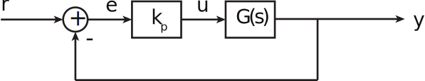
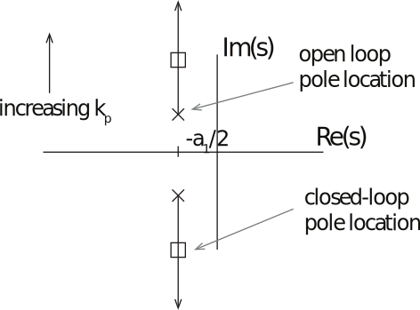
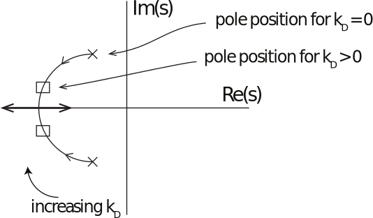
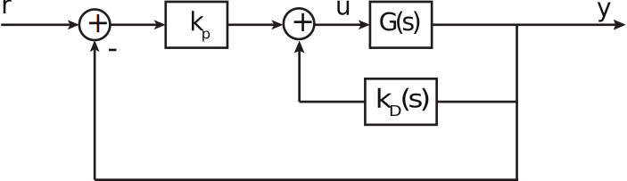
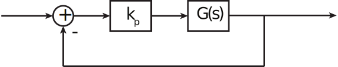
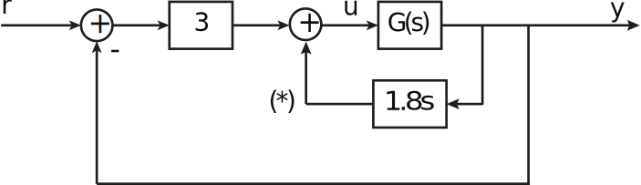
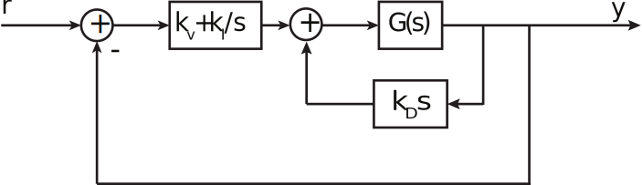
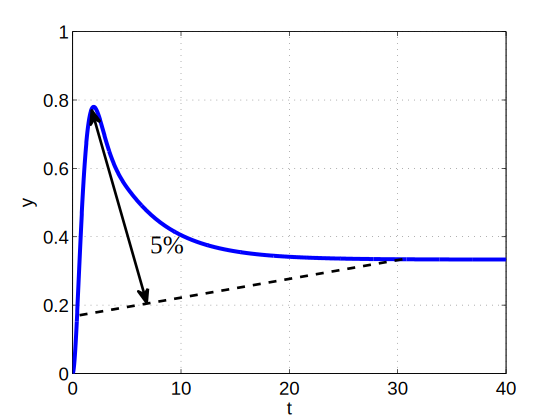

16.6 Principles of Automatic Control | Lecture 10

# PID Control

ПИД-регулятор

A common way to design a control system is to use PID control.

Довольно популярный метод разработки систем управления это применения ПИД-регулятооров

__PID__ = proportional-integral-derivative

Will consider each in turn, using an example transfer function

Рассмотрим каждый из них по очереди использя для примера такую передаточную функцию

$$
G(s) = \frac{A}{s^2 + a_1 s + a_2 }
$$

## Proportional (P\) control

Пропорциональное управление

In proportional control, the control aw is simply a gain, to that u is proportional to e:
При пропорциональном управлении, законт управления

$$u = k_p e$$

For our example, the characteristic equation is
Для нашего примера характеристическое уравнение будет выглядить так

$$
\begin{align*}
0 &= 1 + K_p G(s)\\
 &=  1 + \frac{k_p A}{s^2 + a_1 s + a_2}\\
\Rightarrow 0 &= s^2 + a_1 s + a_2 + k_p A
\end{align*}
$$

The resulting natural frequency is
В результате собственная частота равна

$$\omega_n = \sqrt{a_2 + K_p A}$$

So in the example, increasing kp increases the natural frequency, but reduces the damping ratio. Plot of pole location vs $k_p$:

В этом примере, увеличение $k_p$ увеличит собственную частоту, но уменьшит коэффициент демфирования. Построим зависимость положения полюсов от $k_p$

## Derivative (D) control
Дифференциальное управление

To add damping to a system, it is often useful to add a derivative term to the control,
Для того чтобы увеличить демфирование системы, часто бывает полезно использовать деффиренциальное управление.

What is the characteristic equation?
Каким будет характеристическое уравнение?

So increasing $k_D$ increases the damping ratio without changing the natural frequency, for this example.

И так мы видим что увеличение $k_D$ увеличивает коэффициент демпфирования не изменяя при этом собственную частоту конкретно в этом примере

For kpfixed, $k_D$ varying, plot of closed-loop pole location is:

Для фиксированного $k_p$, $k_D$ может изменяться как показано на диаграмме расположения полюсов замкнутой системы

NB: For other G(s), results may vary. Sometimes, it's better to place derivative feedback in the feedback path:

Замечание: Для других $G(s)$ результат может быть другим. Иногда, лучше поместить дифференциальную обратную связь в контур обратной связи (Другое название связь по скорости)

Why? We get the same pole locations, but no additional zeros to cause additional overshoot. Another way to think about this is that we want the derivative effect on y, because that adds damping, but we don't want to differentiate the reference.

Почему? Мы получим то же располоэение полюсов, но за то никаких дополнительных нулей приводящих к увеличению перерегулирования. Иными словами мы хотим эффект от дифференцирование по выходу y, поскольку это увеличт демпфирование, но мы не хотим дифференцировать входной сигнал.

## Integral (I) control
Интегральное управление

Especially if the plant is a type 0 system, we may want to add integrator to controller to drive steady-state error to zero:

Если у вас система 0-го типа то скорее всего вы захотите использовать интегратор в качестве регулятора чтобы свести установившуюся ошибку к нулю:

Example: Suppose we want a system that

Пример: Допустим мы хотим чтобы система управления имела следующие характеристики

1.  Has rise time above $t_r = 1\:s$
2.  Has peak overshoot of $M_p = 0,05$
3.  Has zero steady-state error to step command

Let's do one piece at a time:

Characteristic equation is

So can only change ωn (and indirectly, $ζ$) with kp. for $t_r = 1$, need

So let's take $k_p = 2$ for simplicity. Then To get $Mp = 5%$, need $ζ = 0,7$. So add derivative control. Characteristic Equation is

The desired polynomial is

So take $k_D = 1,8$.

If PD control is in forward loop,

and the peak overshoot will be 16%, not 5%. So instead, use control structure

 (˚) = "mirror loop feedback"

 With this structure, we have:

So let's add integral control:

 Take $k_I = 0,25$ (_trust me!_) Then

 Response sort of meets specs:

 The response has a long tail, due to slow pole – poles are at:

  ^ slow pole causes long tail.
