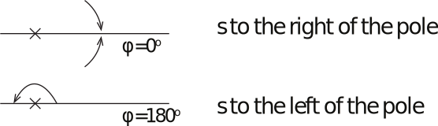
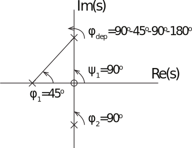

16.6 Principles of Automatic Control | Lecture 12

## Root Locus Rules

- **Rule 1** The n branches of the locus start at the n poles of L(s). m branches end at the zeros of L(s). n - m branches end at s = 8.
- **Rule 2**	The locus covers the real axis to the left of an odd number of poles and zeros.

To the left of the pole, $\varphi = 180^{\circ}$

To the left of a zero, $\Psi = 180^{\circ}$.

To the right of a pole, $\phi = 0^{\circ}$

To the right of a zero, $\Psi = 0^{\circ}$.

 So,

$$
\begin{align*}
\angle L(s) &= \sum_{i=1}^m \Psi_i -\sum_{i=1}^n \phi_i \\
 &= m_1 180^{\circ} - n_1 180^{\circ}\\
 &= (m_1 + n_1) 180^{\circ} - n_1 360^{\circ}\\
 &= 180^{\circ} + l\:360^{\circ}

\end{align*}
$$

if $m_1 + n_1$ is off, where

$m_1$ = number of zeros to the right of $s$

$n_1$ = number of poles to the right of $s$

- **Rule 3** For large $k$, $n - m$ of the loci are asymptotic to the lines emanating from the point $s = 8$, with angles

$$
\theta_l = \frac{180^{\circ} + 360^{\circ} \cdot (l - 1)}{n - m},\;\;\;\;\; l=1,\dots n - m
$$

where $\alpha = \frac{\sum p_i - \sum z_i}{n - m}$

Why? If $s \rightarrow 8,\;k \rightarrow 8$, then to highest order the equation

$$
d(s) + kn(s) = 0
$$

becomes

$$
s^n + \dots + k (s^m + \dots) = 0
$$

So the solution satisfies

$$
\begin{align*}
s^n &\sim - ks^m, \;\;\; (k,s \rightarrow \infty)\\
& \uparrow \textsf{"asymptotic to"}
\end{align*}
$$

$$
\begin{align*}
\Rightarrow s^{n-m} &\sim - k\\
\Rightarrow &\sim (-k)^{\frac{1}{n-m}}\\
&= k^{\frac{1}{n-m}} \angle \frac{180^{\circ} + 360^{\circ} \cdot (l - 1)}{n - m}
\end{align*}
$$

To get the point $s = α$, do asymptotic analysis with next terms: Result is that center of pattern is at:

$$
s = \frac{\sum p_i - \sum z_i}{n - m}
$$

A related rule, not in FPE, is:

- **Rule 3a** If $n - m \geq 2$, the centroid of the closed-loop poles is constant, and is at

$$
\frac{\sum p_i}{n}
$$

To show this, consider a polynomial with roots $z_1, z_2, \dots$ The polynomial is then

$$
(s - p_1) (s - p_2) \dots (s - p_n)\\
= s^n - (p_1 + p_2 + \dots p_n) s^{n - 1} + \dots
$$

Therefore, $a_1 = -\sum p_i$.

Now, the closed loop polynomial is given by

That is, the first term to change in the polynomial is the an´mterm. If n - m >= 2, the a1term is unchanged, and the centroid is a constant.

Note that if m poles go to the m zeros zi, the centroid of the remaining n - m poles must go to

in agreement with rule 3.

•	Rule 4 The angle(s) of departure of a branch of the locus from a pole of multiplicity q is

and the angle(s) of arrival of a branch at a zero of multiplicity q is given by

where the sum sum()˚ excludes to poles (or zeros) at the point of interest.

Example:

