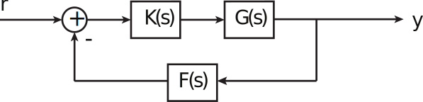
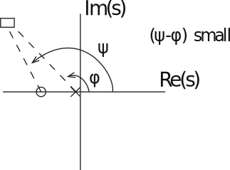
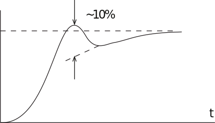
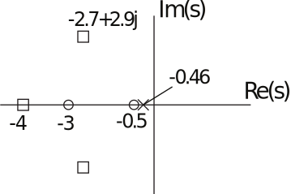

16.6 Principles of Automatic Control | Lecture 14

## Lead Compensator Example (cont-d)

To satisfy the angle condition, require that

From the geometry shown,

To find the gain K, we must invoke the magnitude condition that

at the poles.

So choose compensator

The closed loop transfer function is

The closed loop poles are at

The performance stats are:

### A note on Closed-Loop poles and zeros

Consider a closed-loop system with only one forward path and only one loop:

The poles of

can be found using root locus or other means.
The zeros of T(s) can be found by plugging in for K,G,F, and clearing fractions. However, the result is easy to state:

The zeros of T(s) are the zeros in the forwards path plus the poles in the feedback path. Suppose we add the requirement that

So that steady-state tracking performance is acceptable. How can we modify the controller?

### Lag Compensation

A lag compensator has the form

where β ă α. Typically, α and β are much less (say, a factor of 100 than the natural frequency of the dominant poles.

Why does this work? At low frequency ps « 0q, the gain of the lag compensator is

So the lag compensator increases the d.c. gain by the lag ratio. However, the effect on the dominant pole location is small:

The change in phase angle at the desired pole location is small (θp5˝q), so the locus (away from the origin) doesn’t change much.
Continuing the example from last time, the natural frequency of the dominant pole is 4.24 rad/sec. Need lag ratio of 5. So use compensator

So compensator with both lead and lag is

The response looks like:

The peak overshoot is 3%, but the “natural” overshoot is about 10%. There is also a slow, exponential tail. This is typical with lag compensation. Why?

The closed-loop pole-zero diagram is

The near pole-zero cancellation of pole at -0.46 means the effect of that pole is small, but it has a very long time constant. This pole is responsible for the small but long time constant error.
