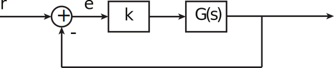
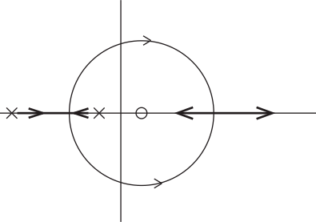

16.6 Principles of Automatic Control | Lecture 15

## The Negative p0˝q Root Locus

Sometimes, we need to plot the root locus for a negative gain parameter

Example:

Longitudinal dynamics of 747, M=0.8 at 20,000 ft.
h “altitude
δe “elevator deflection

Poles of system:
•	 s “ 0 "energy mode" - represents change in total (kinetic plus potential) energy. Hard
to control with elevator - hence near cancellation with zero at s “ ´0.0045.
•	 s “ ´0.6463 ˘ 1.1211j "short period mode." The short period mode is dominated by
changes in aircraft pitch altitude, much like an arrow or weather vane feathering into
the wind.
•	 s “ ´0.003 ˘ 0.0098j “phugoid mode”. This mode represents long period exchange of
kinetic and potential energy, with very small changes in aircraft angle of attack.
Note that:
1. There is a two orders of magnitude difference between the natural frequencies of the
short period and phugoid modes.
2. The phugoid has only the modest damping (ζ “ 0.29). Often, it is much lower, say,
only a few percent.
1

For our discussion, the most interesting aspect is the right half plane zero at s “ `5.61.

Why?

Rewrite the transfer function as

 Look at the feedback loop using only proportional gain1:

So the characteristic equation is:

The question is, should k, (and therefore K) be positive or negative?
Note that because there are an off number of RHP poles and zeros, the D.C. gain Gp0q is
negative. To improve performance at D.C., must have negative gain.
There are other situations where a negative R.L. gain may be required, but this is the most
common.

### Modification to the Root Locus Rules.

The fundamental result is that s is on the negative locus if

for some negative K. If K is negative, ´1{K is positive, so that the angle condition is

So the rules are:

•	 Rule 1: The n branches of the locus start at the n poles. m approach the zeros, n-m
approach 8. (No change)
•	 Rule 2: The locus is on the real axis to the left of an even number of poles and zeros.
•	 Rule 3: The asymptotes are described by

Note: no 180˝ term.
•	 Rule 4: The departure angles from poles and the arrival angles at poles are given by

where q is multiplicity of pole or zero, l “ 1, 2, ...q.
•	 Rule 5: The locus crosses the imaginary axis for values of K at which Routh’s criterion
shows a change in the number of unstable poles. (No change)
• Rule 6: No change in rule for when there are multiple points on the locus.
In summary, all rules are the same, except:
1. All 180˝s become 0˝s.
2. “Odd” becomes “even” in Rule 1.
3

Example

0˝ locus:

Note:
• Locus looks familiar but is different
• RHP zero tends to pull poles into RHP - bad.
