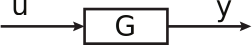

16.6 Principles of Automatic Control | Lecture 16

### Frequency Response Design

Problems with root locus:
•	 Works only for rational transfer functions:

If we start with experiment data, it may be difficult or impossible to put Gpsq in the form
above.
•	 The connection between performance of the system and the root locus is sometimes
poor, so it is difficult to design for some kind of performance.
•	 For simple problems, can guess that right solution is lead (for greater stability or faster
response) or lag (for greater position or velocity constant). For other problems, it’s
harder to guess the right form of the compensator.

Frequency response methods consider the behavior of Gpsq, Kpsq along the jω axis.
That is, we look only at plots of Gpjωq, Kpjωq to determine stability, performance.
Some advantages:
•	 Works with any Gpsq (or Gpjωq), whether rational or not.
•	 It’s relatively easy to determine Gpjωq from experimental data.
•	 Performance requirements can usually be specified in terms of the frequency response
characteristics.
•	 The stability test is straightforward.
•	 There are a few simple rules for determining the type of compensator to use.

One disadvantage:

• Some of the ideas are difficult, even if the techniques are not.

### The Frequency Response

Consider an LTI system G with input u and output y:

If the input is uptq “ est, then a particular solution is:

For a sinusoidal signal

the response is

So the response is sinusoidal, with amplitude AM, where

yptq can be expressed more simply as

where

G may be expressed in polar form as

So if we plot |Gpjωq| and =Gpjωq versus ω, we can easily determine the response to any
sinusoidal input.

Terminology:
M “ |Gpjωq| “ magnitude of Gpjωq
φ “ =Gpjωq “ phase of Gpjωq

### Frequency Response of Lead Compensator

Recall that lead compensator has the form

Rewrite this as

What is magnitude and phase?

Traditionally, |G| is plotted on a log-log plot, =G on a semilog plot, together called Bode plot.

Example:

Notes:
• Low-frequency magnitude = 1 = K(0)
• High-frequency magnitude =10=K(8)
• The phase is always positive - hence phase lead.
Often, magnitude is expressed in decibels, which is basically the log of |G|:

magnitude in decibels=20 log10 |G|
Visualization using Root Locus plane
In root locus form, the lead compensator is

