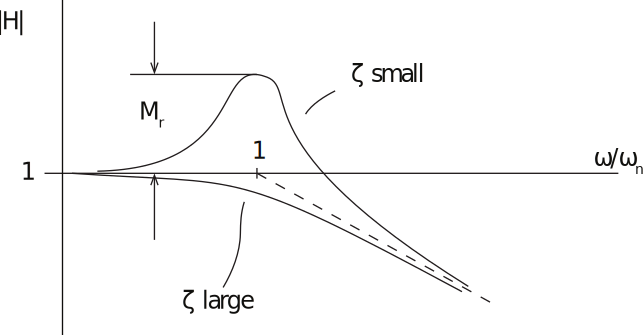

16.6 Principles of Automatic Control | Lecture 17

## Frequency Response Design

Suppose we want to design a closed-loop system with a specific desired response. How might we use the FR to accomplish this?

The Bode (magnitude) plot is as shown in figure below.

Note: See FPE Figure 6.3

We’ll say more on Bode plot construction later. For now, a few importnat points:
•	 The magnitude of the resonant peak is Mr
•	 The resonant frequency, ωr, is close to ωn for lightly-damped systems with greater
damping.
•	 The bandwidth (not shown) is the freq
•	 uency at which |Hpωq| “ 0.707 |Hp0q|
For a given unity-feedback control system

what will closed-loop transfer function

look like?

We can consider three regimes
1. Low frequency: |KG| " 1
In this frequency range, Tpjωq « 1.
2

2. High-frequency: |KG| ! 1.

In this frequency range, Tpjωq « KpjωqGpjωq

3. Crossover: |KG|=1

In this frequency range, |T| “ | KG | “ 1

1`KG |1`KG|
Note that at crossover, |T| depends on the phase of KG.

If KG=1 (phase=0˝), |T| “ 1{2.

If KG=-1 (phase=´180˝), |T| “ 8!

Bottom line is that the phase at crossover has a strong effect on Mrfor the closed-loop system.

For now, it’s enough to note that at crossover, we will have/want

 In practice, we want the phase to be well away from ´180˝, but it will usually be less than
´90˝. A phase of ´120˝often works well, but that depends on the actual specifications.

### Bode Plot Construction

The first step is to the transfer function of interest in Bode form

We can also have second order terms, which we will add later. Since we are plotting (for the magnitudinal plot), log |KG|, we have

So on a log scale, plots of the individual terms add, since the log of a product is the sum of logs.

The K0sα term is plotted as a straight line, since

For example, plot magnitude of 10{s2 :

To plot 1 ` s{a term, note that
