16.6 Principles of Automatic Control | Lecture 17

## Bode Plot Construction (continued)
Note that phase of sα term is

To plot 1 ` s{a term, note that

Example:
Kpsq “ 1 ` s{20

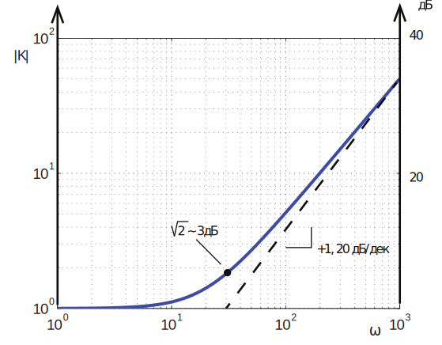

What about the phase?

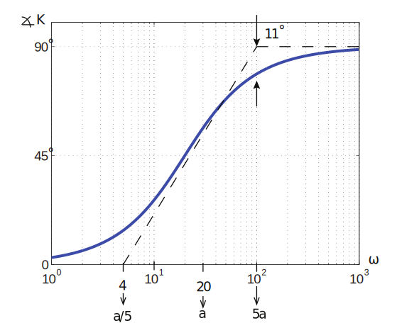

That is, the phase varies by 90˝over the frequency range p a , 5aq. 5
Some people find it easier to draw the construction lines with breakpoints at a{10, 10a.
• Easier to draw
• Less phase error
• Middle segment is not technically an asymptote anyway

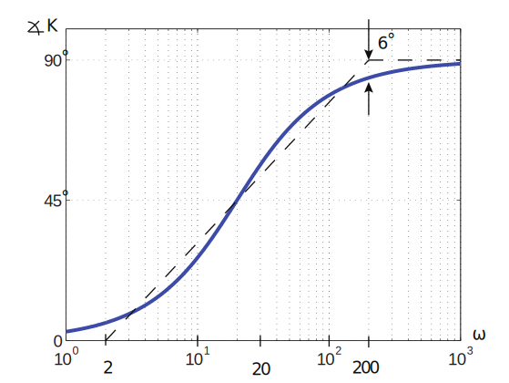

For K “ 1`
1
s{a , the above magnitude and phase plots are flipped about |K| “ 1 or =K “ 0˝

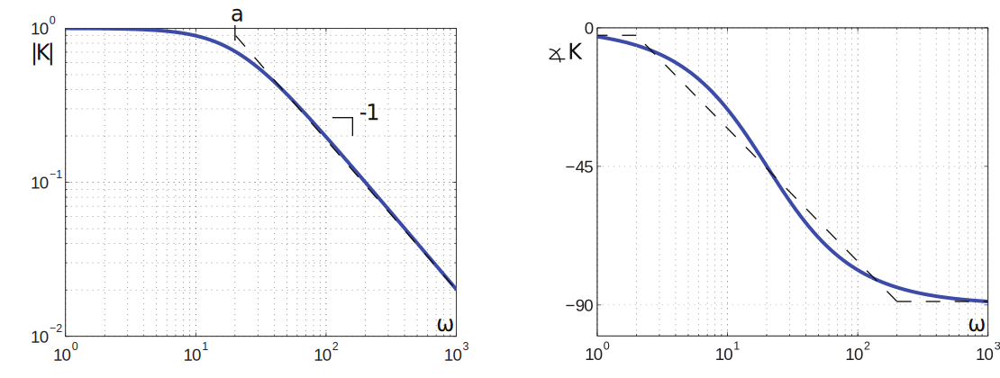

Bode Rules:
Rule 1: Manipulate the transfer function into Bode form.
Rule 2: Determine α for K0sα term. Plot the low-frequency asymptote with slope α(or 20α
dB/dec) through the point ω “ 1, 1 ¨ 1 “ K0.
3

Rule 3: Complete the composite magnitude asymptotes. At each break point, change the
slope by ˘1, or ˘ 2, as appropriate.
Rule 4: Sketch in approximate magnitude curve. (see FPE for more details).
Rule 5: Plot the low frequency asymptote of the phase curve pφ “ α ¨ 90˝q.
Rule 6: The approximate phase is found by changing the phase by ˘90˝or ˘180˝ at each
breakpoint.
Rule 7: Locate the asymptotes for each phase curve, at break points 1{5 and 5 times (or
1{10 and 10 times) the frequency of the magnitude break point.
Rule 8: Graphically add the asymptotes, and draw the approximate phase curve.

Example:

The magnitude break points are

The phase break points are

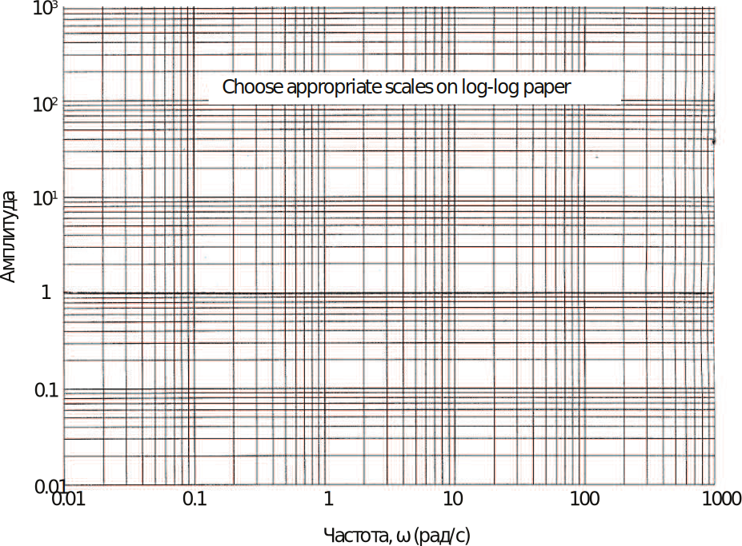

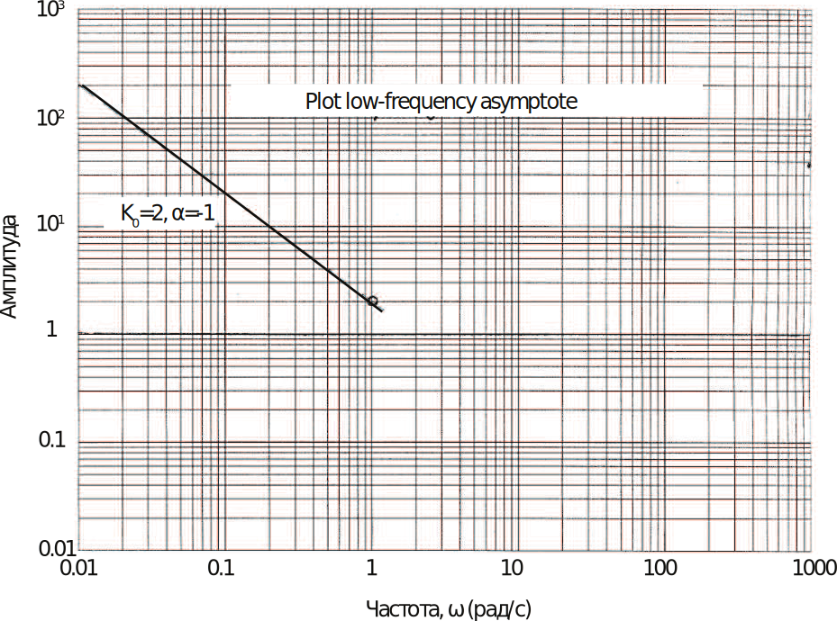

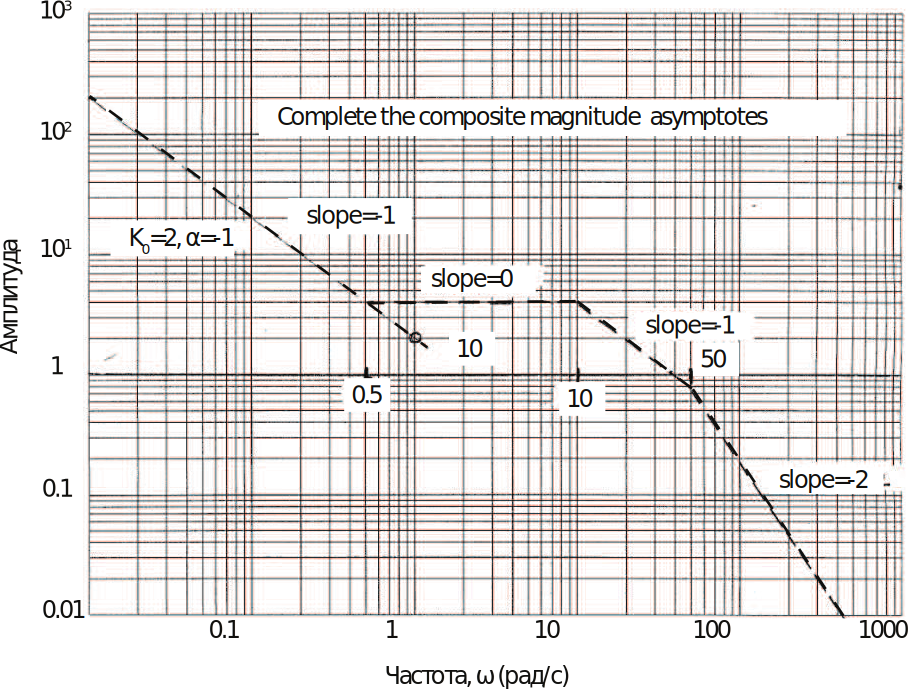

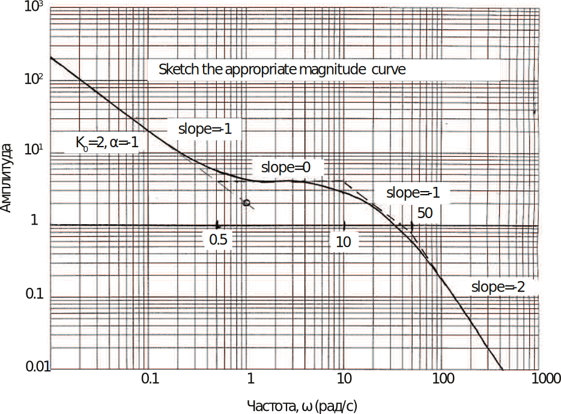

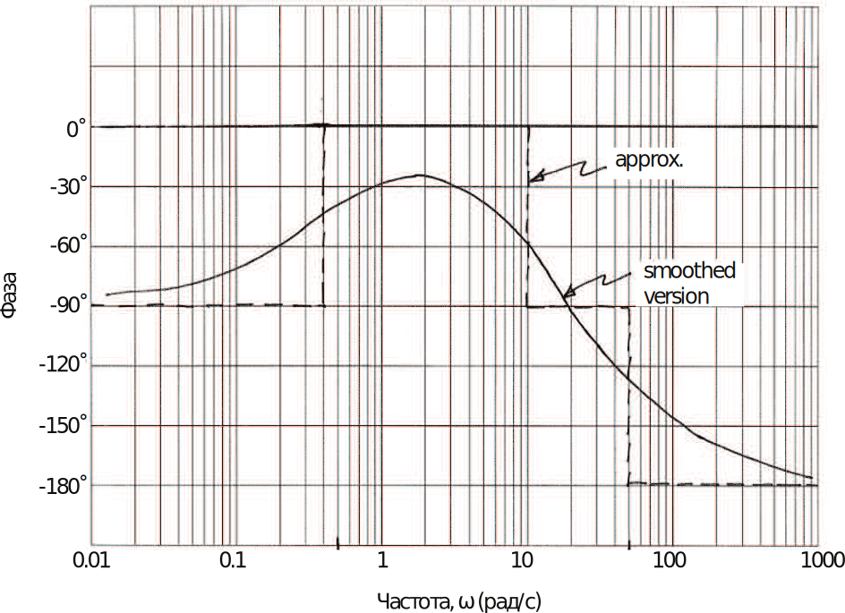

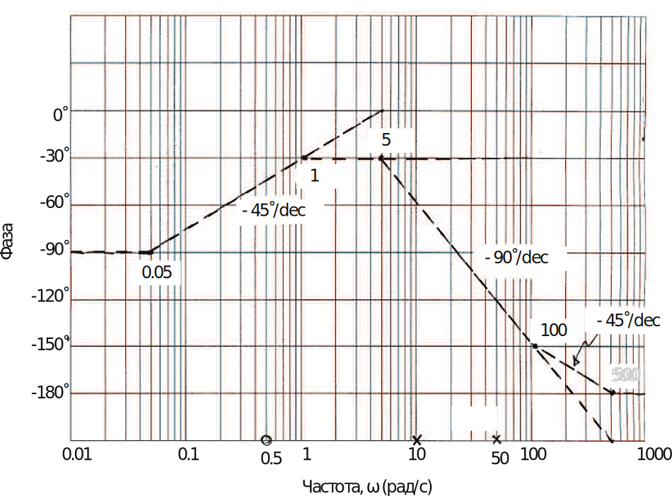

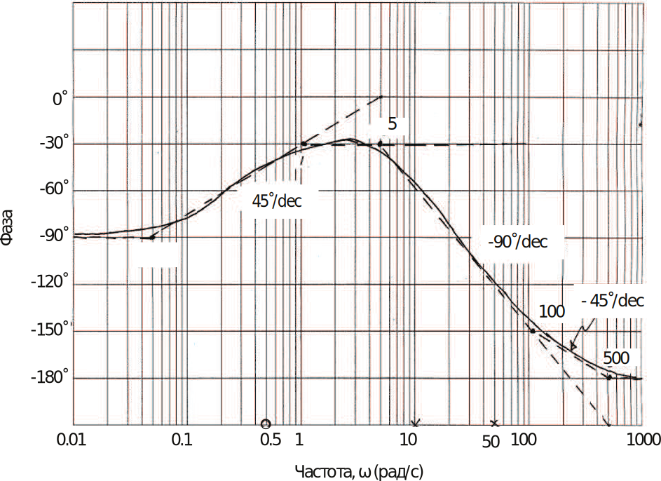
