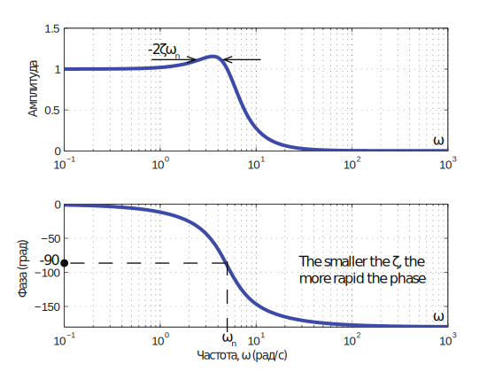
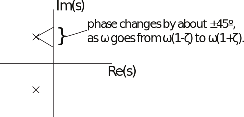

16.6 Principles of Automatic Control | Lecture 19

## Bode Plots With Complex Poles

Second-order term: Usually in denominator:

This is plotted much like first-order term, except slope in high-frequency regime is -2 (-40
dB/dec).

How rapid is phase change?

Magnitude changes from ?
1 to 1 to ?
1 in same range. So width of peak/phase change is 2 2ζ 2ζ 2 2ζ
about 2ζωn.

### Nonminimum Phase Systems

A system with a zero in the RHP is called a nonminimum phase system. Consider

and

G2 has a zero at s “ `10, and so is NMP.
Let’s look at the magnitude and phase of each transfer function:

The magnitude of G2 is similar:

So G1 and G2 have the same magnitude plots.
The phase of G2 is:

So G1 and G2 have the same magnitude, but G2 always has more negative phase.
Note that we can write

This part has magnitude 1, and phase ´2 tan´1 ω{10,
which is negative for all ω ą 0. This result is general ­
for any system G1 with RHP zeros, G1 can be
expressed as

A system with poles and zeros in LHP is called minimum phase, because it has less phase
lag than any stable system with the same magnitude plot. Therefore, a system with RHP zeros is called nonminimum phase.

Two reasons to worry about NMP systems:
1. Usual Bode Rules for phase are backwards, so it’s easy to make mistakes.
2.	 Phase lag is bad, and NMP systems have “excess” phase lag! As we will see, this places
limitations on the performance we can achieve using feedback control.
