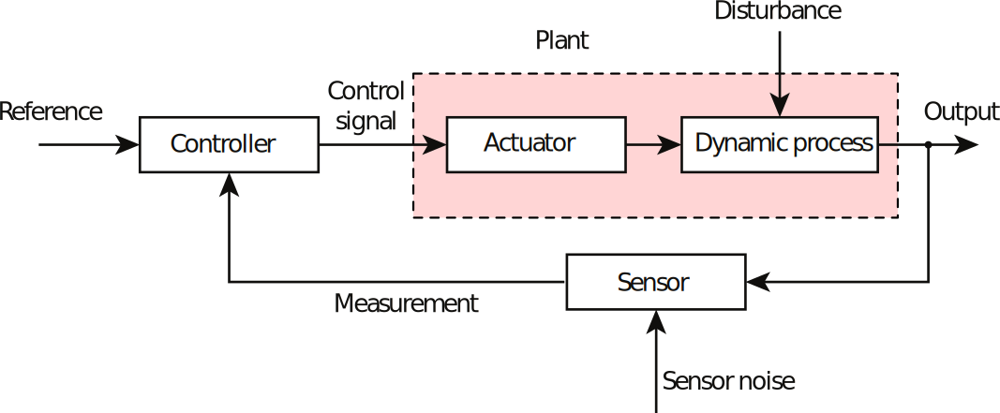
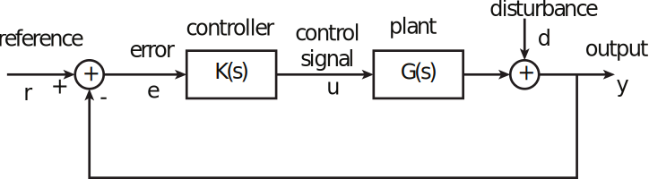
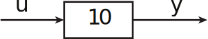
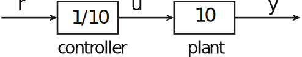
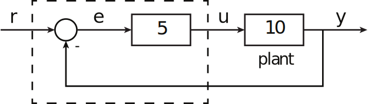
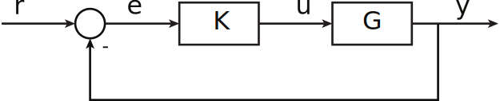
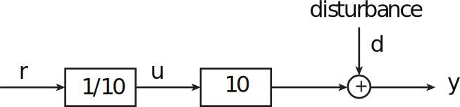
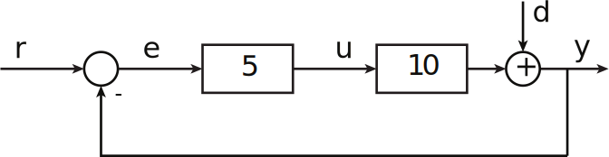

16.06 Принципы автоматического управления | Лекция 2

# Reasons for using automatic control:

*   Reduce workload
*   Perform tasks people can’t
*   Reduce the effects of disturbances
*   Reduce the effects of plant variations
*   Stabilize an unstable system
*   Improve the performance of a system (time response)
*   Improve the linearity of the system

_Для этого необходима обратная связь!_

Components in a typical control system:

Обычно нас интересует случай когда объект управления и регулятор линейны и не зависят от времени или могут быть представлены в таком виде. Тогда мы можем представить элементы системы в виде передаточных функций.

Такая форма записи, в виде структурных схем, чрезвычайно удобна и будет использоваться каждый раз на наших занятиях.

### Почему структурные схемы настолько мощный инструмент?

Система описывается с помощью дифференциальных уравнений, но передаточный функции(преобразование Лапласа) превращают дифференциальные уравнения в обычную алгебру. Ухты!

Рассмотрим простейший объект управления:

Suppose we want $y$ to track reference signal $r$.

Could control by open-loop control

or by closed-loop control

Note that the control gain (5) is arbitrary - we’ll figure out how to chose it later.

### How  well  do  these  control  systems  work?

Look at transfer functions from $r$ to $y$:

$$
\begin{array}{r|c|c}
 & \text{Open Loop} & \text{Closed Loop} \\\hline
\frac{y}{r}  & \frac{1}{10} \cdot 10 = 1  & \frac{5\cdot10}{1+5\cdot10} = \frac{50}{51} \approx 0.98 \\
\end{array}
$$

We want $\frac{y}{r} = 1$, so at first glance, it looks like open-loop is better than closed-loop. However, consider what happens if it turns out our plant model was wrong (or changes), so that really  G(s)= 15. Then

$$
\begin{array}{r|c|c}
& \text{Open Loop} & \text{Closed Loop} \\\hline
\frac{y}{r} & \frac{1}{10} \cdot 15 = 1.5 & \frac{5\cdot15}{1+5\cdot15} = \frac{75}{76} \approx 0.9868 \\
\end{array}
$$

That is, if the plant gain changes by 50%, the transfer function of the open-loop system will vary by 5-%. However, the transfer function of the closed-loop system will vary by only  0.66% (in this case).

More generally, for a typical unity-feedback control system:

More generally, for a typical unity-feedback control system:

$$H = \frac{KG}{1 + KG} = \frac{y}{r}$$

$$is\;S = \frac{1}{1 + KG} = \frac{\%\; change\; in\; H}{\%\; change\; in\; G}$$

%  change  in  H  %  change  in  G

Big  idea:
>High gain control loop reduces the sensitivity of  the control system to variations in the plant.

Now consider effects of a disturbance:

Open-loop:

$$\frac{y}{d}=1$$

Closed-loop:

$$\frac{y}{d} = \frac{1}{1+KG}=\frac{1}{51}=0,02$$

Big  Idea:
>High-gain feedback control greatly reduces the effect of disturbances on the output of a control system.
