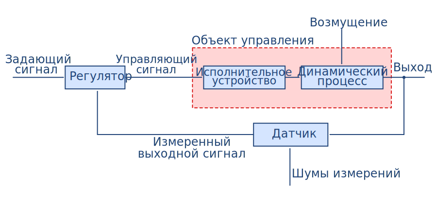
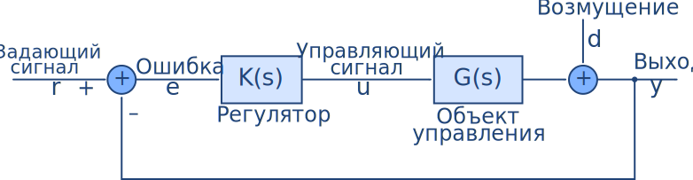
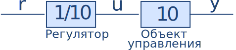
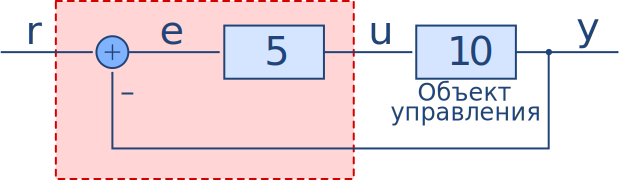
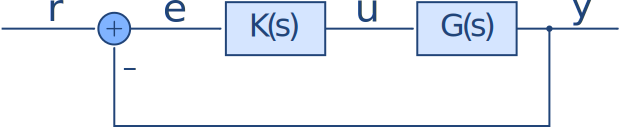
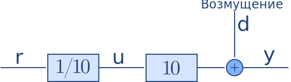
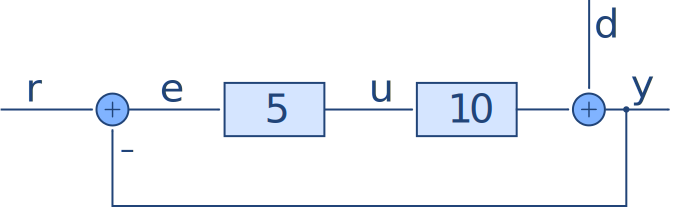

16.06 Принципы автоматического управления | Лекция 2

# Использование автоматического управления позволяет:

*   cнизить рабочую нагрузку;
*   выполнять задачи, которые не могут выполнить люди;
*   снизить негативное влияние внешних возмущений или помех;
*   снизить чувствительность к изменению параметров объекта управления;
*   стабилизировать неустойчивую систему;
*   повысить быстродействие системы
*   Improve the linearity of the system

_Но для этого необходима обратная связь!_

Рассмотрим элементы типовой системы управления:

Обычно нас интересует случай когда объект управления и регулятор линейны и не зависят от времени или могут быть представлены в таком виде. Тогда мы можем представить элементы системы в виде передаточных функций.

Такая форма записи, в виде структурных схем, очень удобна и будет использоваться нами постоянно.

### Почему структурные схемы настолько мощный инструмент?

 Обычно системы описываются с помощью дифференциальных уравнений, но передаточные функции (Преобразование Лапласа) позволяют упростить дифференциальные уравнения до обычной алгебры. Ухты!

Давайте рассмотрим простейший объект управления:

Допустим мы хотим чтобы наш вход $y$ следил за величиной задающего сигнала $r$.
Для этого можно воспользоваться _разомкнутой_ системой управления.

или _замкнутой_ (с обратной связью).

Обратите внимание что коэффициент усиления (5) был выбран случайно, как
правильно подбирать коэффициенты усиления мы рассмотрим позднее.

### Как хорошо эти системы работают?

Взглянем на передаточные функции с $r$ по $y$:

$$
\begin{array}{r|c|c}
 & \text{Разомкнутая} & \text{Замкнутая} \\\hline
\frac{y}{r}  & \frac{1}{10} \cdot 10 = 1  & \frac{5\cdot10}{1+5\cdot10} = \frac{50}{51} \approx 0.98 \\
\end{array}
$$

Мы хотим чтобы $\frac{y}{r} = 1$, так что на первый взгляд может показаться, что разомкнутая система лучше чем замкнутая. Однако, давайте посмотрим что произойдет если мы вдруг обнаружим, что модель нашего объекта управления была описана неверно (или меняется с течением времени). Для этого примем $G(s) = 15$. Тогда

$$
\begin{array}{r|c|c}
& \text{Разомкнутая} & \text{Замкнутая} \\\hline
\frac{y}{r} & \frac{1}{10} \cdot 15 = 1.5 & \frac{5\cdot15}{1+5\cdot15} = \frac{75}{76} \approx 0.9868 \\
\end{array}
$$

То есть, если коэффициент усиление менятся на 50%, передаточная функция
разомкнутой системы изменится на 50%. Тогда как передаточная функция замкнутой
системы изменится лишь на 0.69% (для данного случая).

В целом, для типовой системы управления с единичной обратной связью вида:

Чувствительность передаточной функции замкнутой системы:

$$H = \frac{KG}{1 + KG} = \frac{y}{r}$$

$$is\;S = \frac{1}{1 + KG} = \frac{\%\; change\; in\; H}{\%\; change\; in\; G}$$

Главная мысль:
>Использование большого коэффициента усиления в управляющей цепи разомкнутого контура делает систему управления менее чувствительной к изменению в объекте управления

Теперь рассмотрим влияние внешних возмущений:

Разомкнутая система:

$$\frac{y}{d}=1$$

Замкнутая система:

$$\frac{y}{d} = \frac{1}{1+KG}=\frac{1}{51}=0,02$$

Главная мысль:
>Использование большого коэффициента усиления в системах с обратной связью позволяет значительно уменьшить влияние возмущений на выход системы.
