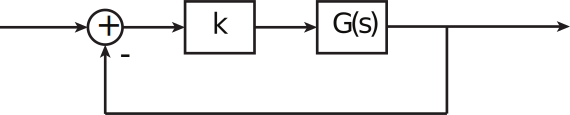
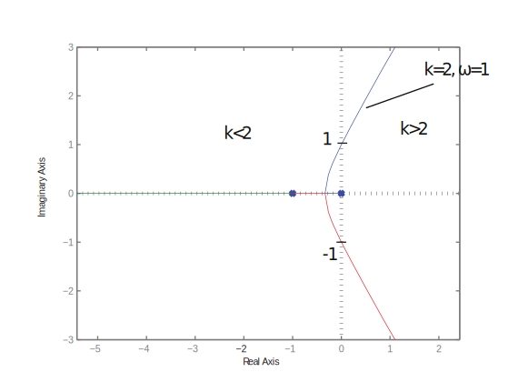
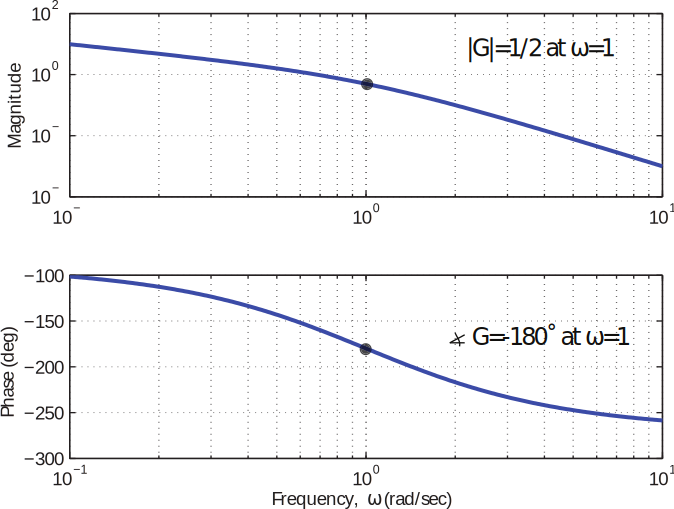
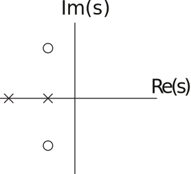
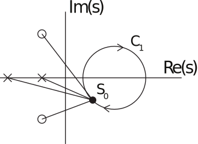
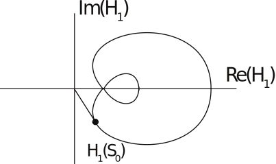
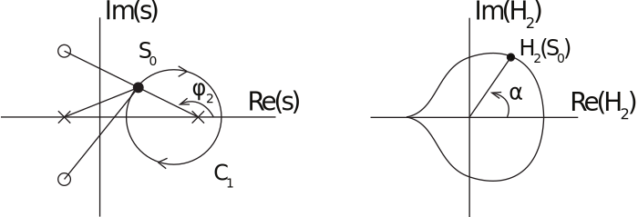

16.6 Principles of Automatic Control | Lecture 20

## Bode Plots With Complex Poles
Suppose we have a proportional feedback system:

What values of k will lead to instability? Before we answer that, let’s find out what values
lead to neutral stability. Take, as an example,

Using root locus and Routh, we can deduce that the C.L. system is stable for

The root locus diagram is:

So neutral stability occurs for k “ 2, corresponding to closed-loop poles at ω “ ˘1.
This result may be seen clearly on the Bode plot for this system.

Recall that the root locus condition is that
kG = 1

or

G = ´1{k

For there to be a closed loop pole on the jω axis for k ą 0, we must have that two conditions
hold. First, G must have phase of ´180˝. The only frequency at which this happens is ω “ 1
rad/sec. Second, we must have that

In this case, |G| “ 1{2 at ω “ 1, so k “ 2 is the required gain to place a pair of poles on the

jω axis.

So the Bode plot plays a key role in stability analysis. We already have a partial result:

If the open-loop system KGpsq is stable, and |KGpjωq| ă 1 for
all ω such that =KGpjωq “ 180˝p mod 360˝q, then the closedloop
system is stable.

This result follows from our R.L. analysis.

Note that the converse statement is not true,that is, there may be frequencies ω such that

|KGpjωq| ą 1 and =KGpjωq “ 180˝, and yet the closed loop system is stable.

The Nyquist Criterion is the Frequency Response analogue of the Routh Criterion - it allows

us to count the number of closed-loop, unstable poles. The Nyquist Criterion depends on

Cauchy’s Principle of the Argument, or simply the argument principle.

The Argument Principle
Consider a transfer function H1psq with pole/zero diagram

We are going to evaluate H1psq point-by-point around the contour C1 :

At each point on the contour, we calculate H1psq and plot:

At any point, say s0, the phase of H1ps0q is

As we go around the contour (in this example), each Ψi and φi increases and decreases, but
returns to its original value after completing exactly one circuit.
Consider a second example, H2 :

In this case, as we move once around C1, Ψi, Ψ2, and φ1 return to their original values,
but φ2 decreases by a net 360˝. As a result, α “ =H2 increases by a net 360˝. But this is
equivalent to saying that H2pC1q encircles the origin exactly once in a clockwise direction.
More generally, the contour map H2pC1q encircles the origin counter-clockwise for each pole
inside C1, and clockwise for each zero. More succinctly, for a clockwise contour C1,

 of clockwise encirclements of the origin by HpC1q= Z - P
where Z = # of zeros of Hpsq inside C1;
and P = # of poles of Hpsq inside C1
