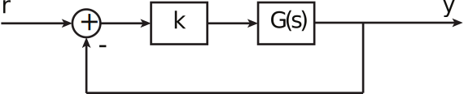
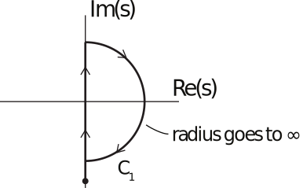
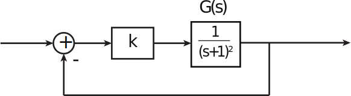
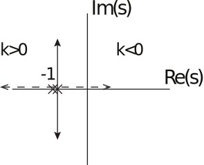
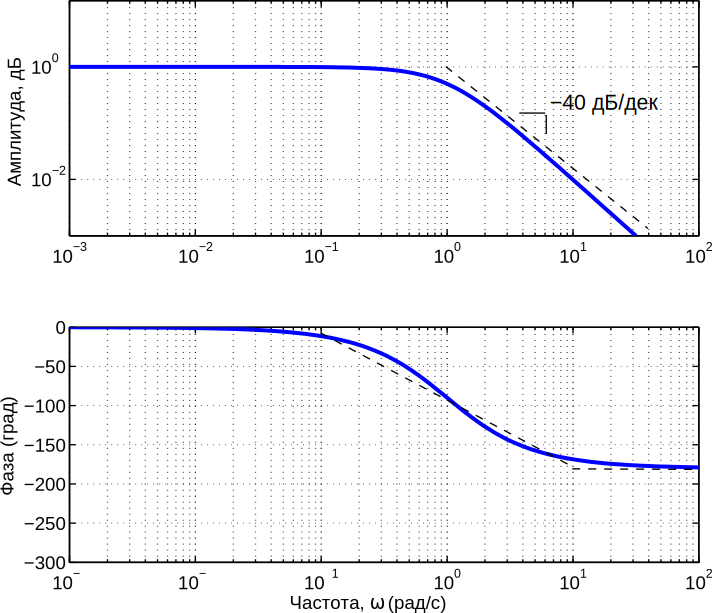
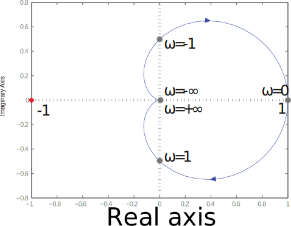
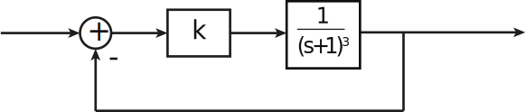
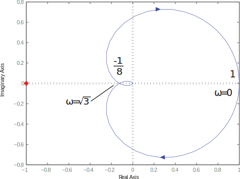

16.6 Principles of Automatic Control | Lecture 21

## The Nyquist Stability Criterion
Can apply the argument principle to finding the stability of the closed loop system

The closed loop transfer function is

The closed loop poles of Tpsq are the roots of

That is, the closed loop poles of Tpsq are zeros of 0 “ 1 ` kGpsq. Note that the poles of
1 ` kGpsq are just the open loop poles of Gpsq. This suggests the following test for stability
of the closed loop system:

Stability Test, Version1:
Define the contour C1 as shown below:

The contour encloses (in the limit) the entire right half plane. For this contour, plot the
contour map

The number of CW encirclements of the origin by 1 ` kGpC1q is equal to Z ´ P, where Z is
the number of closed loop poles in the right half plane, and P is the number of open loop
poles in the right half plane. As an equation

where Z - the number of closed loop unstable poles,
N - the number of CW encirclements of 0,
P - the number of unstable poles

Stability Test, Version 2:
Since the “1” term in 1 ` kGpsq just shifts the contour map of kGpsq by one unit to the
right, it is often (usually) easier to plot kGpsq alone. This is known as the polar plot or
Nyquist plot for the system. Note that for each encirclement of 0 by 1 ` kGpsq, there is one
encirclement of ´1 by kGpsq. So the Nyquist Criterion, in the usual form, is
1.	 Plot kGpsq for ´j8 ď s ď j8. First evaluate kGpjωq for ω P r0, 8s and plot. Then
reflect the image about the real axis and add to the previous image. Note that there
no need to calculate kGpsq on the circular part of C1 if kGpsq Ñ 0 as s Ñ 8.
2.	 Evaluate the number of CW encirclements about ´1, and call that number N (see FPE
for how to count encirclements).
3. Determine the number of unstable poles of Gpsq, P.
4. The number of unstable poles of the closed loop system is
Z “ N ` P
Finally, if k is unknown, we can instead plot Gpsq, and count encirclements of the point
´1{k. This is useful for determining the range of gains for which the closed loop system is
stable, as in root locus.

Examples

Root locus:

Bode plot:

Nyquist plot:

Note that the Nyquist plot does not encircle ´1, and therefore the number of unstable closed
loop poles is

Z “N ` P
“0 ` 0 (no unstable open loop poles)
“0, for k “ 1.

However, we can conclude more than that. The number of encirclements of ´1{k is zero for

Therefore, the system is stable for k ą ´1.

For k ă ´1, N “ 1, so there is one unstable pole.

 Example:

 The Nyquist plot is:

For ´1{k ă ´1{8 p0 ă k ă 8q, system is stable.

For ´1{k ą 1 p0 ą k ą ´1q, system is stable.

For ´1{8 ă ´1{k ă 0, pk ą 8q, system has 2 unstable poles.

For 0 ă ´1{k ă 1 pk ă ´1q, system has one unstable pole.

Of course, this agrees with our Routh and root locus analysis.
