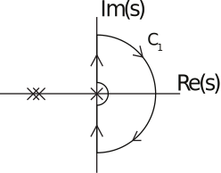
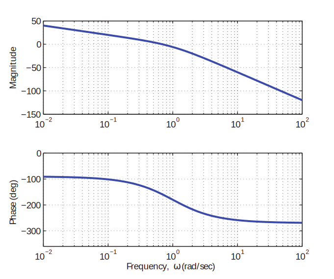
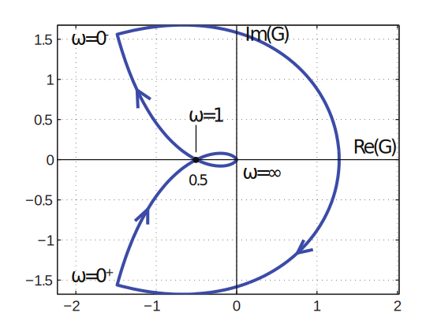
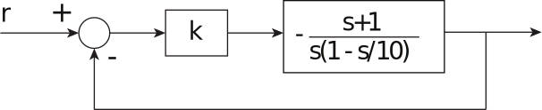
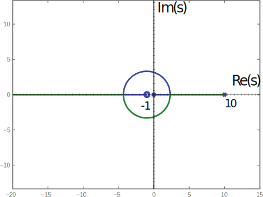
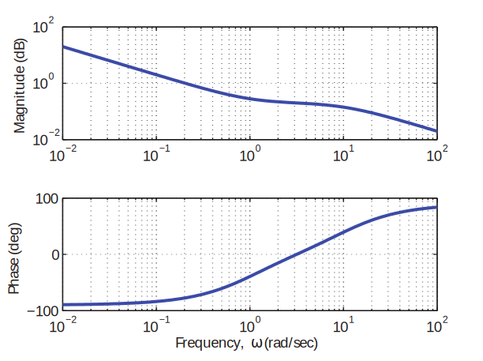
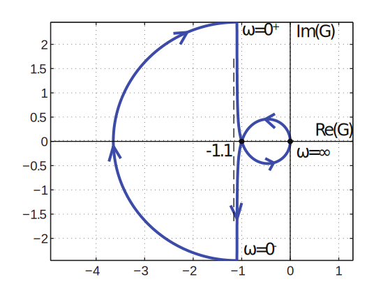

16.6 Principles of Automatic Control | Lecture 22

## Nyquist Plot for Gpsq with jω´axis poles
Consider

Because of pole at s “ 0, must deform “D contour” pC1q.

Bode:

Nyquist:

 Note that deformation in contour (small semicircle in C1) maps to large semicircle in GpC1q.
Since there are no open loop poles inside C1, the number of closed loop poles is

This result is of course in agreement with Routh, root locus.

A note on drawing the Nyquist diagram:
As ω Ñ 0`, note that the Nyquist diagram is asymptotic to the vertical line Repsq “
´2. Since the phase at zero frequency goes to ´90˝, it seems that the diagram should be
asymptotic to the imaginary axis. Why isn’t it?
Express Gpsq as:

For small s, can express as series around s “ 0:

So the diagram is asymptotic to 1 ´ 2

Nyquist Plot of Open Loop Unstable System
Now consider the proportional control of an unstable system:

The root locus:

Bode:

 

 Nyquist diagram:

Note that arc at 8 is clockwise, because deformation at s “ 0 around pole is counterclockwise.

Since there is one open loop pole in right hand plane, need one counter-clockwise encirclement
for stability.

where 0 means no closed loop poles,
´ 1 means counter-clockwise encirclement,
` 1means right-half-plane open-loop or pole.
So system is stable for:

Also, note that for ´1{k ă ´1 p0 ă k ă 1q, N “ 1, so the number of unstable closed-loop
poles is:
