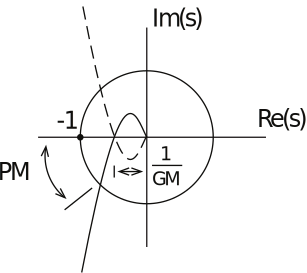
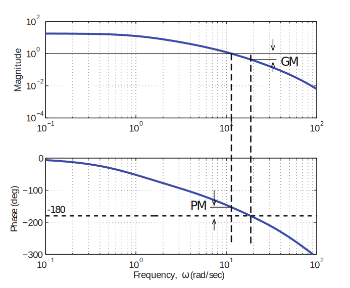
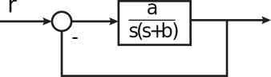
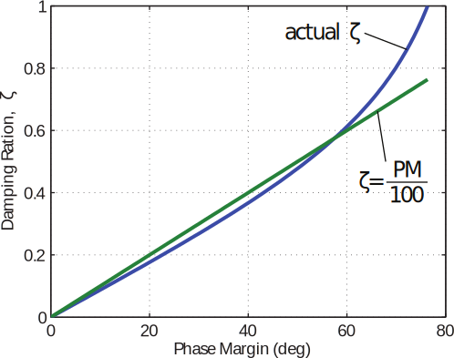
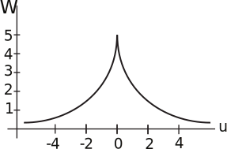
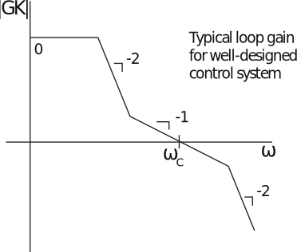

16.6 Principles of Automatic Control | Lecture 23

## Stability Margins
Stability margins measure how close a closed-loop system is to instability, that is, how large
or small a change in the system is required to make it become unstable. The two commonly
used measures of stability are the gain margin and the phase margin.
•	 The gain margin (GM) is the factor by which the gain can be increased before the
system becomes unstable.
•	 The phase margin (PM) is the amount of additional phase lag that would make the
phase be ´180˝ where |KGpjωq| “ 1.
The GM and PM are important not only because they measure how close the closed-loop
system is to instability, but also because they (but especially the PM) can be used to predict
the transient behavior of the closed-loop system.
Gain and phase margin on Nyquist diagram:

GM and PM on Bode diagram:

Relationship between PM and damping
When the phase margin is small, the closed-loop system is close to instability, so that there
will be closed-loop poles near the jω´axis. That is, low PM ñ low damping ratio.
This result can be made explicit by considering the closed-loop system

The closed-loop transfer function is

So

Can show that, for this system,

The functional form isn’t really important - the important point is that ζ is nearly a linear
function of PM:

So can often predict (effective) damping ratio using approximation
PM ζ « (PM in degrees) 100
Even when system is not second order, PM is a good predictor of peak overshoot (Mp), and
resonant peak magnitude (Mr). PM is often specified as a design requirement.

### Bode’s Gain-Phase Relationship
We saw that for poles and zeros in the left-half-plane, the phase of Gpjωq is proportional to
the slope of the magnitude curve (on a log-log scale), but smeared-out. That is,

This idea can be made precise via Bode’s gain-phase theorem:
For any stable, minimum phase system, the phase of Gpjωq can
be determined uniquely from the magnitude of Gpjωq.

The phase is in fact given by

where

Note that this is a funny sort of convolution - we are convolving a weighting function with
the slope of another function, but working on logarythmic axes!
The weighting function looks like:

Note that 92% of area of Wpuq is within ˘1 decade of the center. So the phase is nearly
completely determined by the slope of M within ~1 decade.
Why is this result important? It implies that in almost every case, a well-designed control
loop will have a magnitude plot with slope -1 at the crossovr frequency!

In this case, the phase at cross-over will be a weighted average of ´90˝ (weighted a lot),
´180˝ (weighted some), and 0˝ (weighted hardly at all). So the phase will be between ´90˝ and ´180˝, with probably reasonable PM.
