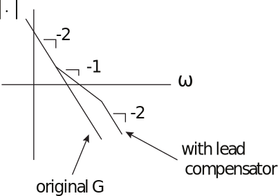
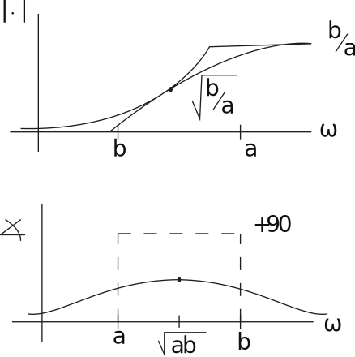
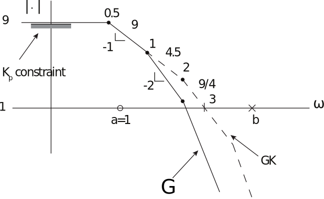
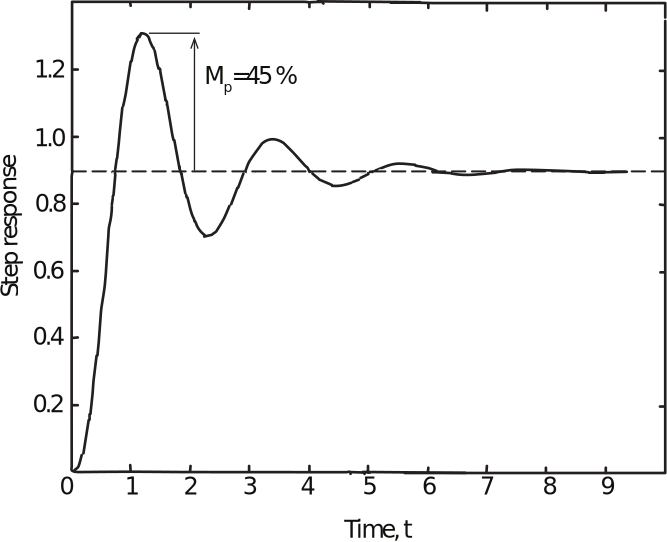

16.6 Principles of Automatic Control | Lecture 25

## Lead Compensation
One problem with PD controller is that the gain gets large at high frequencies. So instead
use lead compensator

What is the strategy? Look at Bode plot:

To get most phase lead for given lead ratio pb{aq, place pole and zero symmetrically around
desired crossover. This maximizes average slope near crossover.
The magnitude and phase of a lead compensator are

The phase of the lead compensator is

The maximum phase lead is

So to get 60˝phase lead (for this example), need lead ratio

So take

As ωc “ 1.3 r/s,

Therefore, |GK| “ 1 ñ k “ 0.453. The compensator is then

Again from Matlab,

Lead Compensation to achieve minimum Kp.
The example is similar to, but not identical to, FPE example 6.15.
The problem is to control the plant

So that

Kp “ 9 guarantees only 10% tracking error in steady state; PM ě 30˝ensures a minimum
stability margin.
First, consider a proportional controller, with unity feedback

Then the control system has

So need to add lead compensation to increase PM.
Bode:

To get better slope at crossover, add lead compensator. It’s convenient to place zero at
s “ ´1, since this cancels plant pole, and makes Bode plot simpler. Working out the
geometry, this puts the cross-over at

at least using the straight line approximation.

Our goal is to use the smallest b that meets specs. At crossover, the phase is

Solving for b,

So trial controller

Using Matlab, found

 Phase margin is larger than required, so can reduce phase lead by 6.5˝ at (new) ωc.

 Solving for b, we have

 So new controller is

 which has

 DONE! The step response is shown in the figure below. Note that Mp is larger than would
be expected (« 37%) given the PM. This is typical of systems with modest kp.

