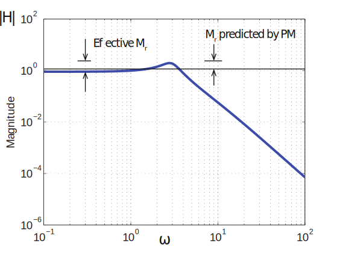
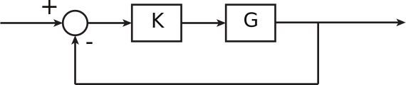
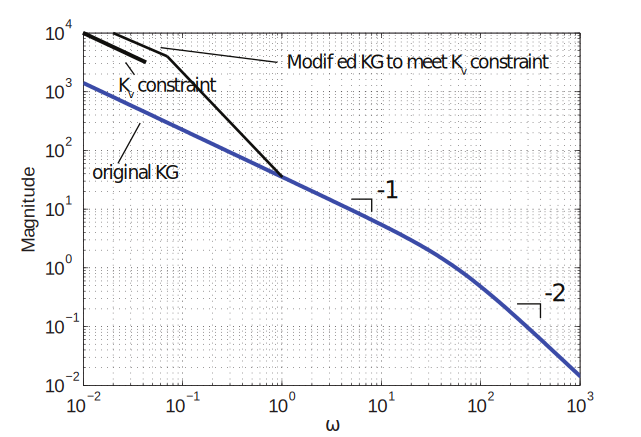
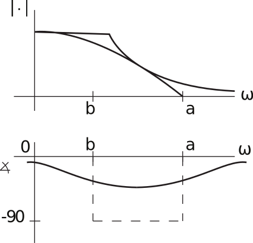
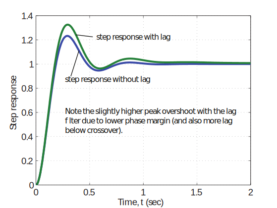
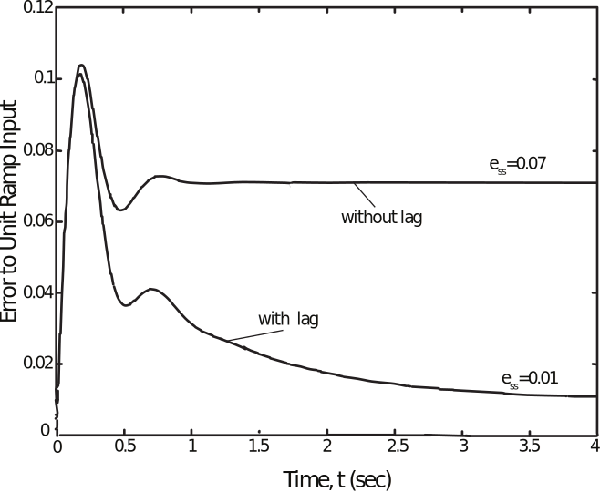
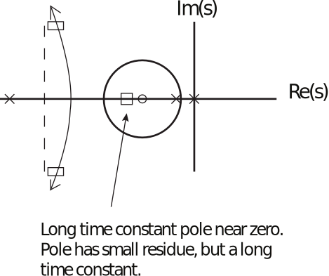
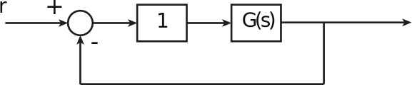
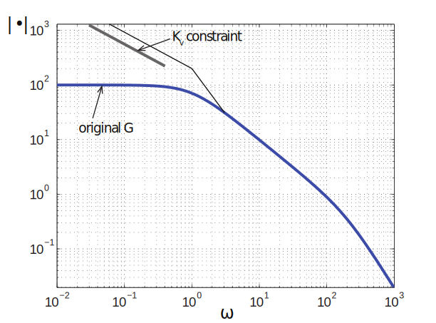

16.6 Principles of Automatic Control | Lecture 26

From last time, we had plant and compensator

The closed-loop step response has 45% overshoot, when 37% expected. Why?
Look at Bode plot of H “ KG : p1`KGq

Because of low Kp, D.C. gain of H is 0.9, which increases effective Mr by factor of 1/0.9.

Lag Compensator
Consider the plant

In a unity feedback control system

Suppose we use a proportional controller

For this controller,

and the overshoot in response to a unit step is

Suppose that we find the response of the closed-loop system satisfactory, except that the
velocity constant Kv “ 14.1 is lower than desired (Kv “ 100). How might we improve the
response?
Look at Bode plot:

Placing Kv constrain on Bode plot shows that we must somehow make slope steeper for a
bit to achieve the requirement, if we want crossover behavior to be similar. We do this with
a lag compensator:

On order to achieve our design goals, we need the lag ratio a{b to be the amount of additional
low frequency gain required. In our case,

We also need

So that not too much phase lag is added at crossover. It’s common to use

which ensures ă 6˝ of phase lag will be added at crossover.
So the new Compensator is

How well does the new compensator work? Compare step responses, error response to ramp
inputs (see plots).

Note that although the steady-state error to a ramp input is reduced, there is a long tail to
the response. Why? Look at Root locus:

Long time constant pole near zero.
Pole has small residue, but a long
time constant.
Note the constant pole near lag zero. Pole has small residue, but a long time constant.
This behavior is very typical of systems with lag of PI control. To eliminate, must increase
bandwidth (crossover frequency), which is not always desirable.

PI Control
PI (proportional-integral control) is used when the type of the system must be increased,
say, from type 0 to type 1.
Example: Consider a system that performs adequately with unity feedback

where

but we desire a type 1 system with velocity constant Kv “ 100. Look at problem on Bode
plot:

So the compensator is

 Note that error pole will be near s “ ´3. To speed up error response, use

which will result in pole near s “ ´10
