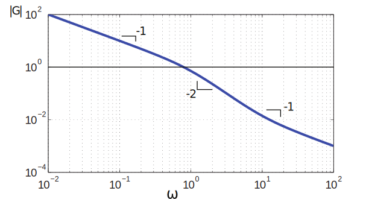
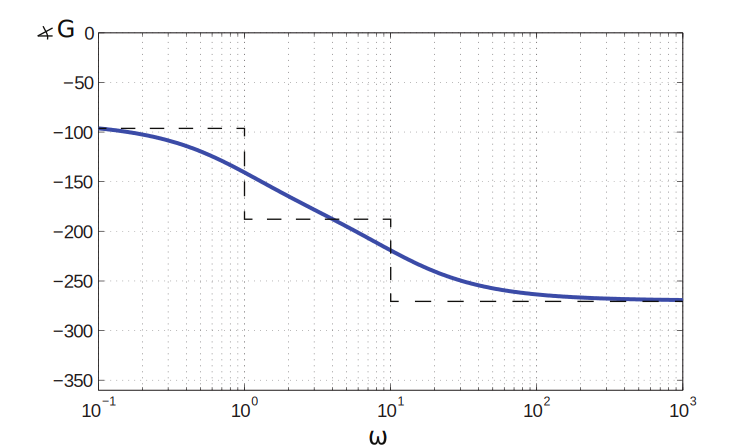
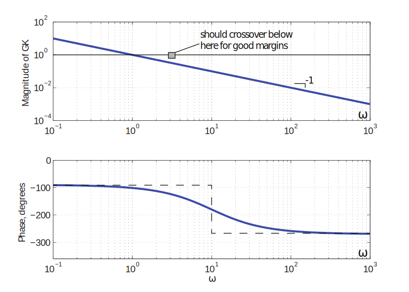
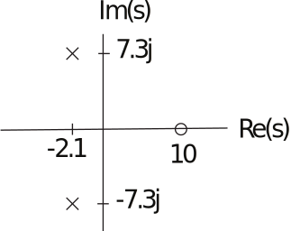
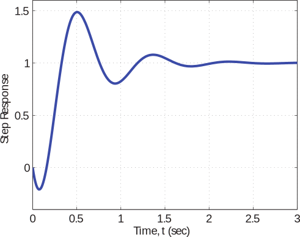
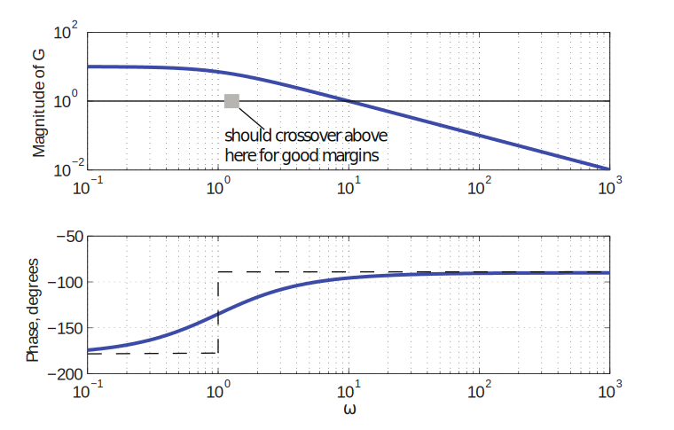

16.6 Principles of Automatic Control | Lecture 27

## Nonminimum Phase Systems
Our design rules so far are based on the bode gain-phase theorem, which applies to stable,
minimum phase systems. The RHP zeros or time delays of NMP systems place fundamental
limitations on the achievable performance of any closed-loop systems.
Example:
Consider the plant

Our goal is to design a closed-loop controller with bandwidth as large as possible. How well

can we do?

Bode plot:

The slope at high frequency is ´1, so it seems that we should be able to cross-over anywhere.
However, in this case we need to look at the phase plot, sicne gain-phase theorem does not
apply:

Note that additional phase due to zero at s “ `10 is negative.

So if we use pure gain, the crossover frequency must be below about ωc “ 3.

Let’s add compensation to make slope ´1 everywhere:

Bode Plot:

So NMP zero causes significant phase lag (relative to the phase expected from slope) at

frequencies up to one decade below crossover.

Suppose we could accept PM as low as PM “ 30˝. What would control system look like?

Solve for k:

Therefore,

See step response plotted below:

Note that Mp « 49%.
In addition, there is a 20% undershoot (wrong way behavior).
The bottom line is that a non-minimum phase zero places fundamental limitations on the
bandwidth of the closed-loop system. As a practical matter, if the NMP zero is at s “ a, we
must have

More realistically, to achieve reasonable phase margins and step response, we need

Even at ω “ a{10, the NMP zero adds 12˝ of anomalous phase lag.

Time Delay
The effect of a pure time delay is similar to that of a NMP zero. Indeed, a time delay is
non-minimum phase. The transfer function os a T-second delay is

So the additional phase lag is ωT. As a practical matter, must cross over at

but more reasonably should have

Unstable systems
For an unstable system, the Bode gain-phase theorem does not apply either. In this case,
however, the disagreement between slope and phase occurs at low frequency (when viewed
properly).

Example:

Bode:

Using arguments similar to those made for NMP zeros, can see that we need to crossover at
least at

where p is the location of the unstable pole.
Note that this is a fuzzy requirement - inthe example, can stabilize the system wtih any
ωc ą 0, but margins will be poor unless ωc ě 2 r/s.
