16.6 Principles of Automatic Control | Lecture 21

## The Nichols Chart
The Nichols chart may be thought of as a Nyquist plot on a log scale. A Nyquist plot is a
plot in the complex plane of

Instead, on a Nichols chart, we plot

Notice that we reverse the coordinates - the real part is plotted on the vertical, and the
imaginary part is plotted on the horizontal.
In addition, the chart has contours of constant closed-loop magnitude and phase,

The Nichols chart template is shown below. Usually, we are interested in the range of
frequencies where the phase is greater than ´180˝. The Nichols chart is often expanded (see
plot below).

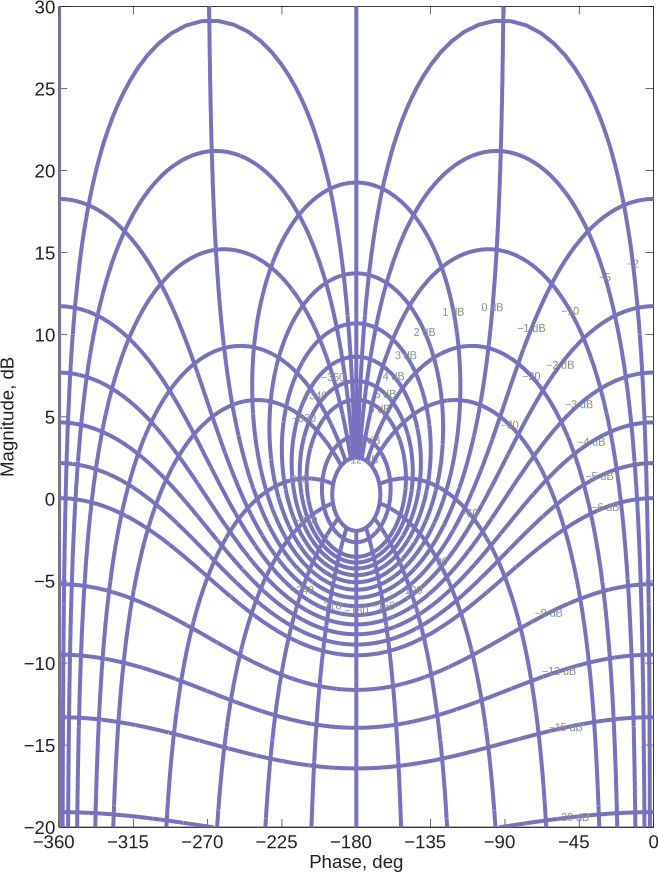

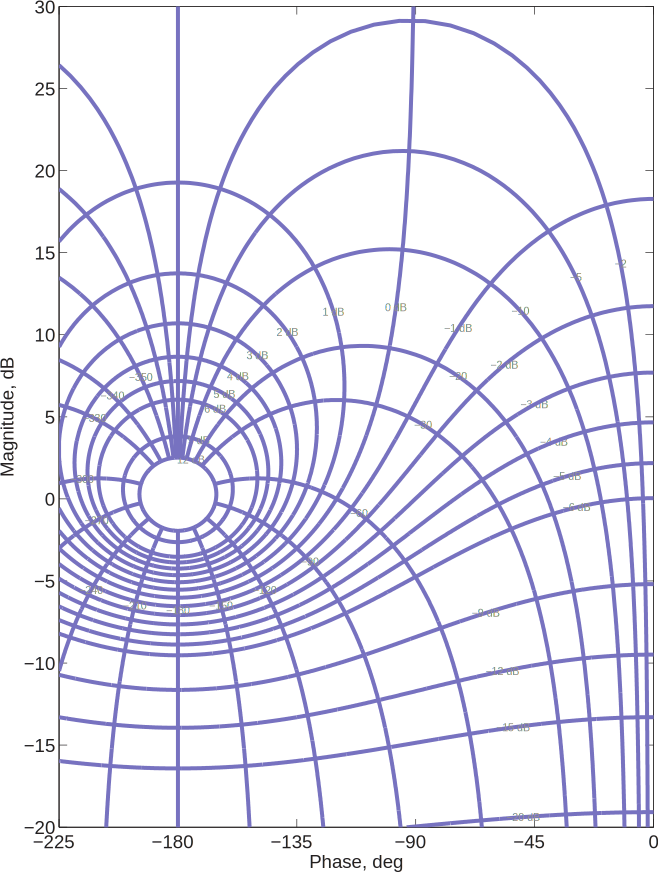

The Nichols chart was once very useful, since computers were not available to do the kids of
calculations that are now done by e.g., Matlab.
However, Nichols chart may be used to give insight into the closed-loop behavior of systems.
Consider first the system

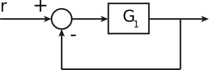

where

which has ωc “ 10 r/s, PM “ 45˝.
G1 “
?
2 10
sp1 ` s{10q
Bode of G1:

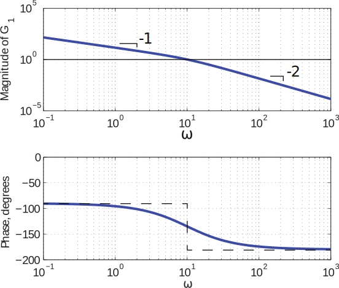

The Nichols plot can be made by lifting points of the Bode plot, at individual frequencies,
and plotting on the Nichols chart. See plot below for the plot of G1 :

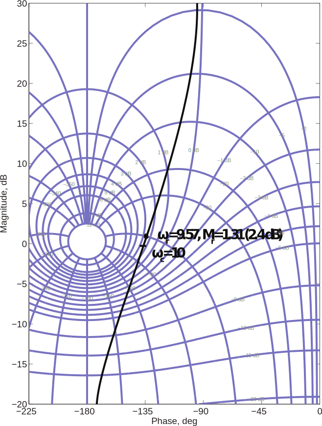

Note that ωr « ωc, so the peak in the frequency response (CL) is very close to crossover.
Note also that

For PM “ 45˝, we expect

In pretty good agreement with the actual results.
Now consider the plant

in a similar unity feedback control. For this system, we have

Bode plot:

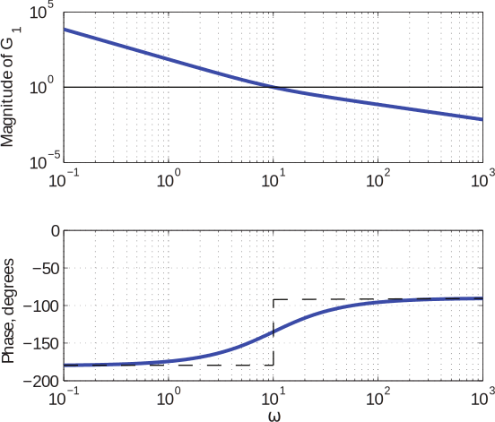

Since the crossover and phase margin are the same, we expect to get similar performance.
Do we?
One clue can be seen in the Nichols chart, below.

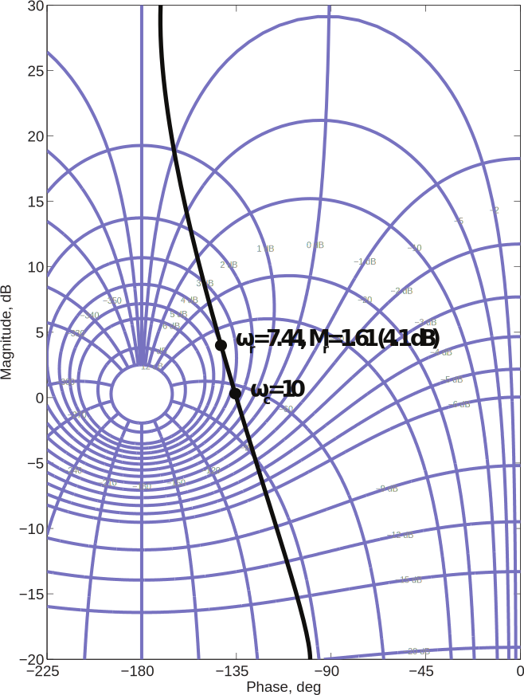

Note that, in this case, ωr is significantly smaller than ωc, and Mr is larger than might be expected from the PM. So we would expect that the closed-loop system

would be a bit slower, and have more overshoot, than the system

even though they have the same PM and ωc.
In fact, this is the case, as seen from the step responses below.

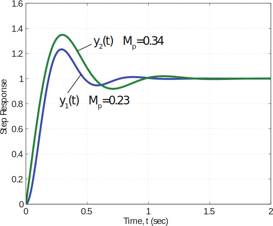

Counting Encirclements on a Nichols Chart
Counting encirclements on a Nichols chart can be tricky, because
1. The ´1{k point can be on either the ´180˝ line or the 0˝line.
2. CW and CCW are reversed, because the orientation of the axes is reversed.
Will demonstrate with examples.

Example 1.

Nyquist and Nichols plots are shown below

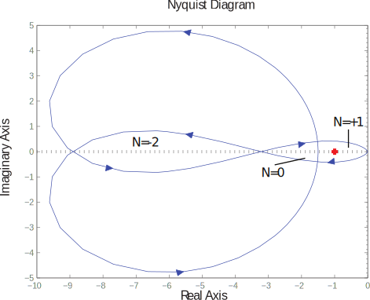

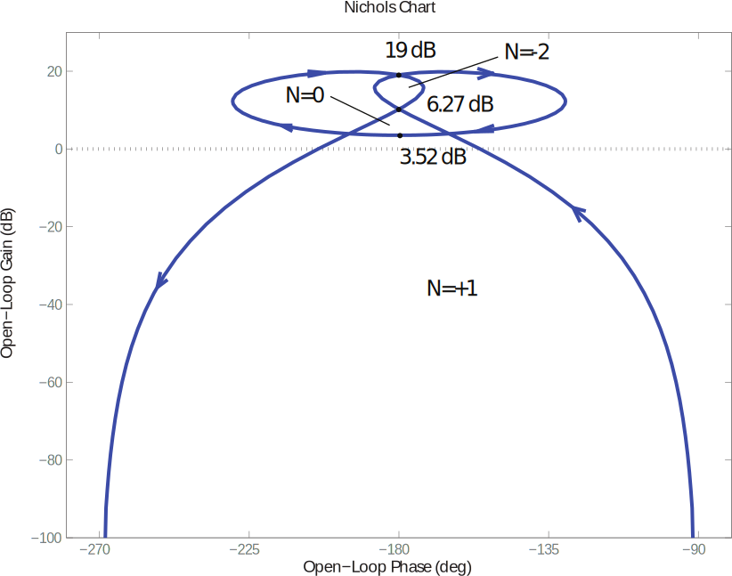

Example 2

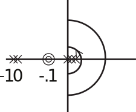

Nichols chart is shown below. Note that care must be used to properly close contour near
ω “ 0.

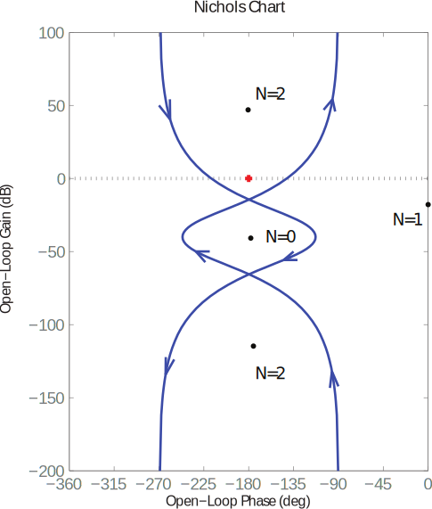
