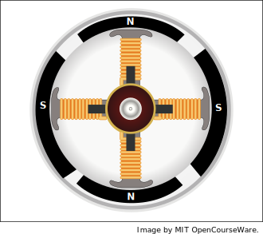
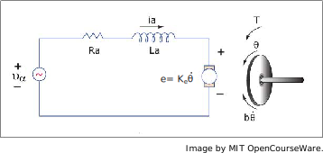

16.06 Принципы автоматического управления | Лекция 3

# Modeling principles:

1.  Identify the states of the system:
    *   positions;
    *   velocities;
    *   inductor currents;
    *   capacitor voltages;
    *   etc.

2.  Используя знание физики найдите $\frac{dx_1}{dt}, \frac{dx_2}{dt},\ldots$

3.  Преобразуйте вынеся производную в левую часть:

$$\frac{dx}{dt}=\underline{f}(\underline{x}, u)\qquad y=g(\underline{x}, u)$$

где,

$$
\begin{align*}
x &-\text{вектор состояния} \\
u &-\text{управляющий сигнал}\\
y &-\text{измеренный выходной сигнал}
\end{align*}
$$

4.  Линеарезуйте если потребуется.

### Моделирование двигателя постоянного тока

Физическое представление:

Модель:

The states are:
Переменные состояния:
$$
\begin{align*}
x_1 &= \Theta\;-\;\text{угол поворота двигателя}\\
x_2 &= \dot{\Theta} \;-\;\text{угловая скорость двигателя}\\
x_3 &= i_a \;-\;\text{ток в обмотке двигателя}
\end{align*}
$$

Определим уравнения движения:
$$
\begin{align*}
\dot{x}_1 & = \frac{d\Theta}{dt} = \dot{\Theta} = x_2\;\text{(из уравнений Кинематики)}\\
\dot{x}_2 & = \frac{d\dot{\Theta}_1}{dt}  = \ddot{\Theta}
\end{align*}
$$

From free body diagram:

$$
\begin{align*}
J\ddot{\Theta} & = - b\dot{\Theta} + T\\
- b\dot{\Theta} & =\;\text{вязкое трение в роторе}\\
T & =\;\text{вращающий момент пропорциональный току}\\
   &=\; K_t i_a ,\; \text{где}\; K_t\;\text{постоянная момента двигателя}
\end{align*}
$$

Таким образом,

$$
\begin{align*}
\ddot{\Theta} & = - \frac{b}{J} \dot{\Theta} + \frac{K_t}{J} i_a\\
\dot{x}_2 &= - \frac{b}{J} x_2 +  \frac{K_t}{J} x_3
\end{align*}
$$

Now model the circuit. Start with motor part itself. The power supplied to the motor is
Теперь опишем мат. модель электрической цепи. Начнем с описания самого двигателя. Мощность потребляемая двигателем равна:

$$P=e i_a$$

This must equal (by 1st law) the torque power:
По первому закону  потребляемая мощность должа равняться электромагнитной мощности

$$P = T\dot{\Theta} = K_t i_a \dot{\Theta}$$

Приравняв уравнения выше получим:

$$e = K_t \dot{\Theta}$$

Следовательно,

$$K_e = K_t$$

Теперь мы можем найти $\frac{d i_a}{dt}$:

$$
\begin{align*}
\frac{d i_a}{dt} & = \frac{1}{L} (v_a - i_a R_a - e)\\
& = \frac{1}{L} (v_a - i_a R_a - K_t \dot{\Theta})
\end{align*}
$$

Следовательно,

$$\dot{x}_3 = - \frac{K_t}{L} x_2 - \frac{R_a}{L} x_3 + \frac{1}{L} v_a$$

In state-space form:

$$
\begin{align*}
\underline{\dot{x}} &= \left( \begin{array}{ccc}
0 & 1 & 0\\
0 & -b / J & K_t / J\\
0 & - K_t / L & - R_a / L
\end{array} \right) \underline{x} + \left( \begin{array}{c}
0\\
0\\
\frac{1}{L}
\end{array} \right) v_a\\
\\
\theta & =  \left( \begin{array}{ccc}
1 & 0 & 0 \end{array} \right)  \underline{x}
\end{align*}
$$

This is in the form

$$
\begin{align*}
\underline{\dot{x}} & = A \underline{x} + B u\\
y & = C  \underline{x} + D u
\end{align*}
$$

Note: FPE uses

$$
\begin{align*}
\underline{\dot{x}} & = F \underline{x} + G u\\
y & = H  \underline{x}
\end{align*}
$$
