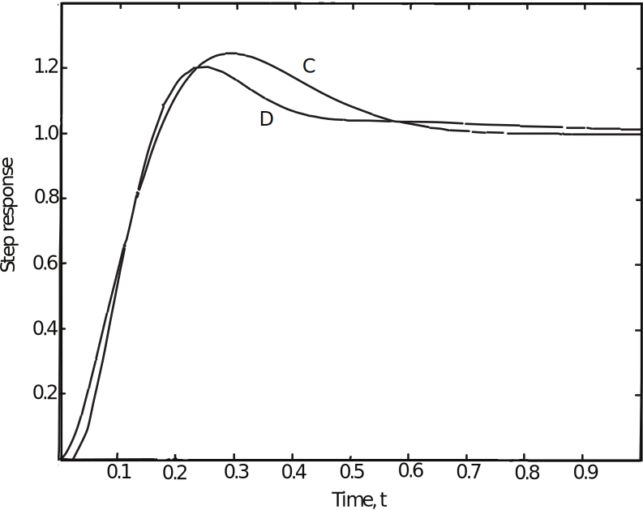
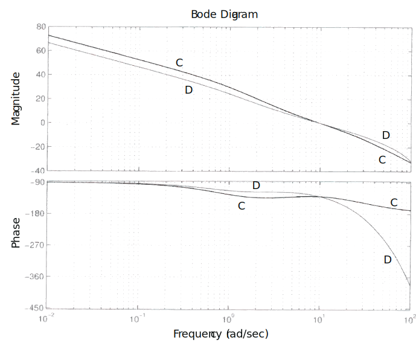
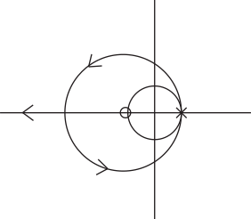
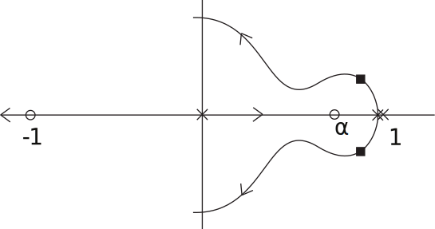
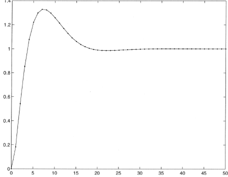

16.6 Principles of Automatic Control | Lecture 32

(continued from previous lecture..)

Note the much improved response. Now we have:

- very close!
Full cycle processing delay
What happens when processing delay is a full period, T? In the textbook, this case is
described as requiring that the numerator of Kd must have one less power of z than the
denominator. However, in the emulation approach, this might be tricky.
The solution is to account for the delay in Gd by adding the factor 1{z, which is the ztransform
of a one sample delay. So for the previous example, we would have:

So now we have an effective delay of 3
2T, 1
2T from the ZOH, and T from the processing delay.
Let’s redo the design assuming this larger delay:

So the lead ratio satisfies

So let

The continuous compensator is

Using the Tustin transform, we obtain:

See the step response below. Why is the continuous and discrete response so different?
Kpsq for the continuous system and Kdpsq for the discrete system are different - they have
different DC gains and different lag ratios. As a result, the Bode plots for the loop gains are
significantly different (see the plot below).

Discrete Design
Can also design directly in z-plane, using root locus or other tools.
When we designed Kdpzq using emulation methods, we needed Gdpzq only to rest our result,
not to do the design, for which we only needed Gpsq. (We also calculated the equivalent
delay, T{2 or 3T{2.)
For discrete design, however, we need Gdpzq, which may be calculated as

Example

as before.
The basic control laws:
Proportional:

Derivative:

Integral:

Lead:

Example
Design a digital controller for the plant

with sample period T “ 1 sec, so that ωn « 0.3 r/s, and ζ “ 0.7.
The discretization plant is

We want the closed loop poles to be at

So we want the dominant closed-loop poles at

Proportional gain does not work, since the locus is

which is entirely outside the unit circle. Instead, use a PD controller, which will be of the
form

So new root locus will be:

Choose α to get angle condition right

We need

So controller is

To find k, use gain condition

The step response is shown below. Notice that the overshoot is significant - much more than
would be expected with ζ “ 0.707, due to zero of the compensator.
So let’s put derivative term in a minor loop:

