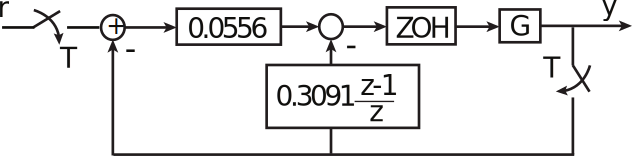
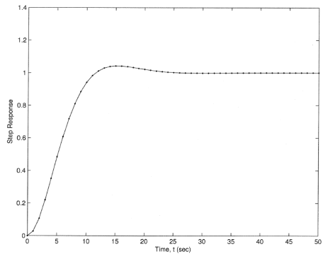

16.6 Principles of Automatic Control | Lecture 33

Note that

The step response is shown below. Note the much improved response. The peak overshoot
is

very close to the ideal Mp “ 0.043 for ζ “ 0.7071.

Discrete Design vs. Emulation
The text argues that discrete design should be used if

or

I disagree. If the effective time delay is taken into account, emulation works well out to

and maybe higher. But that is close to the upper limit on how high it is possible to cross
over due to T{2 time delay.

So emulation should work in all but the most severe cases

The W´Transform
The W ´ Transform is used to allow the use of classical continuous time design techniques
(including Bode plots) on discrete-time systems.
Recall that the Tustin transform is

So there is no confusion, we use the variable W instead of s, so the W´transform is

Can show that this mapping between z and W:
• Is one to one (unique W for each z, vice-verse).
• Maps the unit disk to the left half plane.
Note that the W-transform “warps” frequencies:

Therefore,

where ω “physical frequency,

Example

Design a controller Kdpzq so that

First, find GpWq using MATLAB:
gw=d2c ( gd , ’ t u s ti n ’ )
Result is

Zero at W “ ´30, 000 can be ignored, but note presence of RHP zero at W “ `200.
Alternatively, map poles and zeros by
