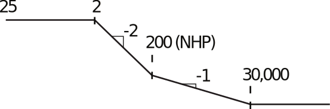
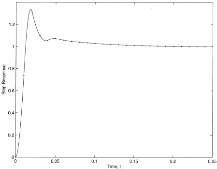
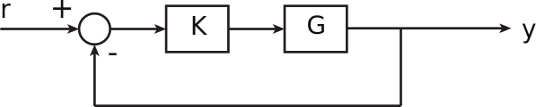
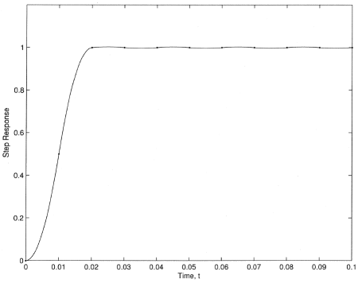
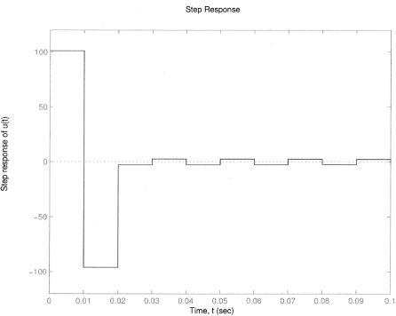
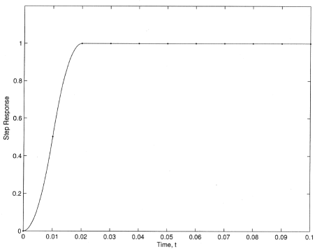
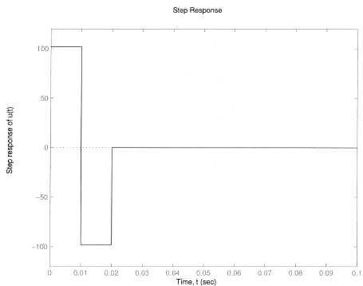

16.6 Principles of Automatic Control | Lecture 34

Zeros: z “ ´0.9867.. Ñ W “ ´30, 000
z “ 8 Ñ W “ `200
Poles: z “ 0.9802 Ñ W “ ´2
Bode Gain: Gdp1q “ 25.

Also, need to map crossover frequency:

 There’s not much warping at ωT “ 0.5 (2%). At ωT “ 1.0, there is 9% warping; at ωT “ 1.5,
24%. So for most problems, may not need to prewarp.
Bode plot of G:

To meet specs, need lead around νc “ 51, lag below ν “ 5.1.

So need phase from lead compensator

where 6˝ anticipates lag compensation.

For this compensator, Kp “ 136. So need lag ratio of 36.76.

Therefore, the compensator is

The discrete time compensator is the Tustin transform, yielding

Remarks:
1. Compensator is almost identical to what would be found if we used emulation, if we
include effective T{2 delay of ZOH.
2. W-Transform approach guarantees stability of discrete-time system. Not really an issue
for ωcT “ 0.5, but might be for faster crossover.
3. Note RHP zero at wW “ `T
2 “ 200. This zero limits achievable bandwidth of controller,
just like time delay.

Example
Same plant as above. Make ωc pνcq as high as practical and still have 50˝phase margin.
Solution: Let’s pick crossover frequency νc to be factor of only 2 below NMP zero.

Use lead compensator to get desired PM and crossover

See step response below

Direct Design
Suppose we have the usual unity feedback control structure:

(The system might be continuous or discrete). Suppose we want the closed loop transfer
function

to have a specific form, e.g., have a particular rise time, settling time, etc. Why not just
solve for desired K in terms of G, H?

So

Note that K essentially cancels G with the factor 1{G, so makes the loop gain

exactly what is needed to have the desired closed loop transfer function.
But we can’t choose any H desired!

Constraints on H:
Stability In order that K not cancel on unstable pole or NMP zero, we must have that
1. H must have as zeros all the zeros of G outside the unit circle.
2. 1 ´ H must have as zeros all the unstable poles of G.
Causality In order that K be causal, we must have:
3. The relative degree of H is at least as large as the relative degree of G

Example

 do a direct design such that
1. The system is Type 1: ñ Hp1q “ 1.
2. The system is deadbeat (all poles of H at z “ 0).
Therefore, might select

Then
See responses on next two pages. Note the “ringing” in urks. To eliminate, put zero of H at
´0.9867.

To eliminate ringing, choose

