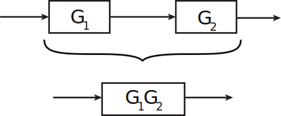
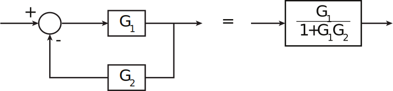
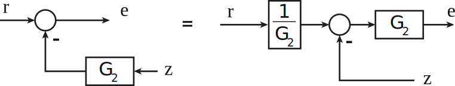
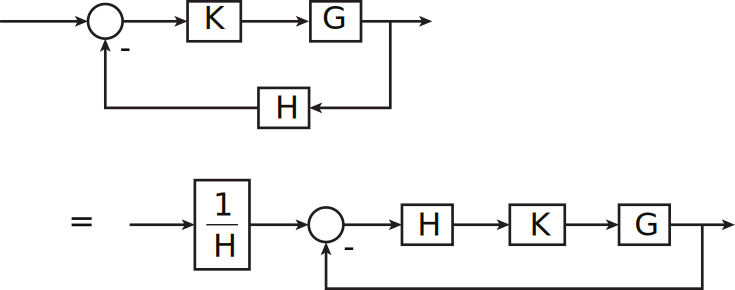
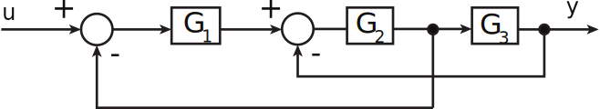

16.06 Principles of Automatic Control | Lecture 4

# Block Diagram Manipulations:

>The gain of a single loop feedback system (with sign “-1” in the loop) is the forward gain divided by the sum of 1 plus the loop gain.

So,

Mason’s Rule:

$$
\begin{align*}
 H(s)     & = \frac{1}{\Delta} \sum_{i} H_i \Delta_i                                \\
 H(s)     & = \text{losed-loop transfer function}                                   \\
          & = 1-\sum \text{all loop gains}                                          \\
          & =\; + \sum \text{(products of 2 loops that don't touch)}                \\
          & =\; - \sum \text{(products of 3 loops that don't touch)}                \\
          & = \dots                                                                 \\
 H_i      & = i^{th}\;\text{forward path}                                           \\
 \Delta_i & = \text{determinant of}\;i^{th}\;\text{path}                            \\
          & = \text{value of D for that part of diagram that does not touch path i}
\end{align*}
$$

**Example**

$$H(s) = \frac{G_1 G_2 G_3}{1 + G_1 G_2 + G_2 G_3}$$
