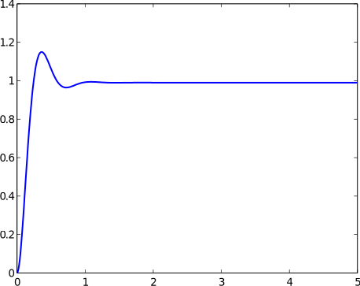
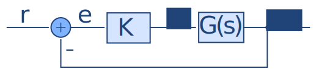
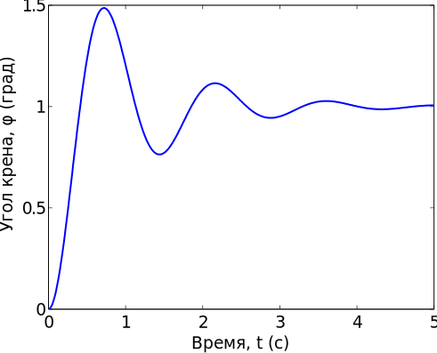

16.06 Principles of Automatic Control | Lecture 5

## Dynamic Response:
Динамика системы

Обычно мы находим реакцию системы используя преобразования Лапласа. Проще всего сделать это с помощью MATLAB.

**Пример: Двигатель постоянного тока**

Допустим:

$$
\begin{align*}
J &= 0,01\;kg\cdot m^2;\;b=0,001\;N-m-sec \\
\\
K_t &= K_e = 1\; n-M/A = 1\; V/(rad/sec)\\
\\
R_a &= 10\Omega,\; L= 1\; H
\end{align*}
$$

Тогда

$$
\begin{align*}
\frac{\Omega}{V_a}(s) &= \frac{100}{s^3 + 10,1 s^2 + 101 s}\\
\frac{\Omega}{V_a} &= \frac{s\Theta}{V_a}(s) = \frac{100s}{s^3 + 10,1 s^2 + 100s}\\
&= \frac{100}{s^2 + 10,1 s +101}\\
G(s) &= \frac{100}{(s+5,05 + j 8,6889)(s+5,05 + -j8,6889}
\end{align*}
$$

Как будет выглядить переходный процесс этого двигателя? Иначе говоря, как будет вести себя скорость двигателя в зависимости от времени, если $v_a (t) = \sigma (t)$?

Если бы мы делали все вручную, нам пришлось бы посчитать:

$$\begin{align*}
g_s (t) &= L^{-1} \left[ \frac{1}{s} G(s) \right]\\\\
\frac{1}{s} G(s) &= \frac{100}{s(s + a + jb)(s+ a - jb)}\\\\
&= \frac{r_1}{s} + \frac{r_2}{s + a + jb} + \frac{r_3}{s + a - jb}
\end{align*}$$

Затем, разложив на сумму элементарных дробей, найти $r_1 ,\; r_2 ,\; r_3$. Для каждого элемента определить $L^{-1}$ (обратное преобразование Лапласа), сложить все вместе и  упростить. В общем много работы.

Но вместо этого можно использовать MATLAB:

```matlab
num = [0 0 100];
den = [1 10.1 101];
sysg = tf(num, den);
t = 0:0.01:5;
y = step(sysg, t);
plot(t, y);
```

Приведенный код построит нам вот такой график:



_Рисунок 1 – Скорость двигателя_

Система выше — разомкнутая. Для замкнутой системы, после получения передаточной функции, можно сделать тоже самое.

**Пример:**

Передаточная функция от задающего сигнала элерона $\delta_a$ к углу крена $\varphi$ имеет вид:

$$\frac{\Phi}{\delta_a}(s) = \frac{k}{s(\tau + 1)}$$

$$
\begin{align*}
\text{где} \; k &= \text{steady roll-rate per unit of aileron deflection}\\
\tau &= \text{roll subsidence time constant}\\
&= \frac{I}{-M_{\phi}}
\end{align*}
$$

Допустим $\delta_a$ измеряется в процентах от полного отклонения, тогда $\delta_a = 1$ это полное отклонение правого элерона, $\delta_a = -1$ — левого. Возьмём такие исходные данные:

$$
\begin{align*}
k &= 100\; \text{град/с}\\
\tau & = 0,5\; с\\
G(s) &= \frac{100}{s(0,5s + 1)}
\end{align*}
$$

Допустим мы применяем следующий закон управления:



Какой будет передаточная функция замкнутой системы?


$$
\begin{align*}
H(s) &= \frac{KG(s)}{1+KG(s)} = \frac{\dfrac{Kk}{s(\tau s + 1)}}{1 + \dfrac{Kk}{s(\tau s + 1)}}\\
&= \frac{Kk}{\tau s^2 + s + Kk}
\end{align*}
$$

Пример $K = 0,1/c$, тогда:


$$
\begin{align*}
H(s) &= \frac{10}{0,5 s^2 + s + 10}\\
H(s) &= \frac{20}{0,5 s^2 + 2s + 20}
\end{align*}
$$

Построим переходный процесс с помощью MATLAB:

```matlab
num = [0  0  20];
den = [1 2 20];
sysg = tf(num, den);
t = 0:0.01:5;
y = step(sysg, t);
plot(t, y);
xlabel(’Время, t (с)’);
ylabel(’Угол крена, \phi (град)’);
```



_Рисунок 2 – Зависимость угла крена от времени_

Мда...Не очень хороший результат. Система получилась слишком колебательной! Ничего, остановимся на этом чуть позже.
