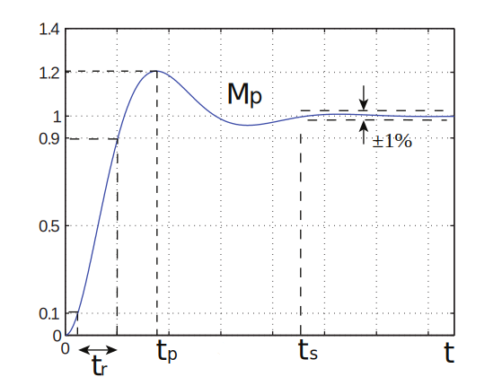
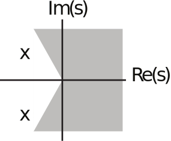
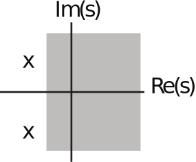
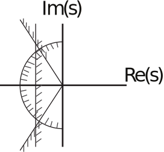

16.06 Principles of Automatic Control | Lecture 6

# Time Domain Specifications:

Many control systems are dominated by a second order pair of poles. So look at time response (to step input) of

$$H(s) = \frac{\omega_n^2}{s^2 + 2 \zeta \omega_n s +\omega_n^2 }$$

Typical response:

$$
\begin{align*}
M_p &= \text{peak overshoot}\\
t_r &= \text{rise time (10% to 90%)}\\
t_s &= \text{settling time (1%)}\\
t_p &= \text{time of peak}
\end{align*}
$$

Each of the above parameters may be important in the design of the control system. For example, the designer of a hard disk drive may specify a maximum settling time of the response of the read/write head to a commanded change in position.

Peak overshoot is important, both because it is a measure (to a degree) of stability, and for practical reasons, overshoot should be minimized (think of an elevator!).

Rise time $t_r$ (and to a lesser extent peak time $t_p$) is a measure of the speed of response of the system.  Often, a maximum $t_r$ will be specified.

We can connect $\zeta$ and $\omega_n$ to $M_p,\; t_p,\; t_r$ , with two important caveats: first, some of the rela­ tionships are approximate. Second, additional poles and zeros will change the results, so all of the results should be viewed as guidelines.

The step response of $H(s)$ is

$$h_s(t) = 1 - e^{-\zeta \omega_n t} \left( \cos (\omega_d t) + \frac{1}{\sqrt{1 - \zeta^2}} \sin (\omega_d t) \right)$$

Using elementary calculus, we can find $t_p$ and $M_p$ (see text):

$$
\begin{align*}
t_p &= \frac{\pi}{\omega_d}\\
M_p &= e^{\frac{-\pi \zeta}{\sqrt{1 - \zeta^2}}}\\
&= e^{- \pi \tan \Theta}
\end{align*}
$$

where $\Theta = \sin^{-1} \zeta$.

Typical values:

$$
\begin{array}{|c|c|}
\hline
\zeta & M_p \\\hline
0,5 & 0,16 \\\hline
0,7 & 0,05 \\\hline
\end{array}
$$

The rise time is approximately

$$ t_r \approx \frac{1,8}{\omega_n}$$

The _rise time_ is a bit faster for systems with less damping, a bit longer for systems with more damping, and sensitive to additional poles and zeros.

The _settling time_ can be approximated via:

$$
\begin{align*}
e^{- \zeta \omega_n t_s} &\approx 0,01\\
\\
\to t_s &\approx \frac{4,6}{\zeta \omega_n}
\end{align*}
$$

Note that, in reality, settling time varies discontinuously with $\zeta$, since as damping increases, a peak may decrease from just over 1,01 to just under 1,01, so $t_s$ is drastically reduced.

## Desired  pole  locations

Given specifications on $t_r,\; M_p$, and $t_s$, where should poles be?

$$
\begin{align*}
t_r &\le a\\
\to \frac{1,8}{\omega_n} &\le a\\
\to \omega_n &\ge \frac{1,8}{a} = {\omega_n}_{min}
\end{align*}
$$

Likewise, to keep $M_p$ less than a fixed value, must have $\zeta \ge \zeta (M_p)$:

Finally, must have:

$$\zeta \omega_n \ge \frac{4,6}{t_s}$$

Putting these constraints together will yield an allowable region for the poles (see better drawing in text):

**N.B.:** The allowable region is a guide. After a system is designed, the performance will have to be evaluated.
