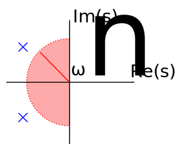

16.06 Principles of Automatic Control | Lecture 6

# Time Domain Specifications:

Временные характеристики

Many control systems are dominated by a second order pair of poles. So look at time response (to step input) of

$$H(s) = \frac{\omega_n^2}{s^2 + 2 \zeta \omega_n s +\omega_n^2 }$$

Реакция системы управления на ступенчатое воздействие:

$$
\begin{align*}
M_p &= \text{максимальное перерегулирование;}\\
t_r &= \text{время нарастания  (с 10% до 90%);}\\
t_s &= \text{время установления или время переходного процесса (1%);}\\
t_p &= \text{время максимума.}
\end{align*}
$$

Каждый из этих параметров может быть важен при проектировании системы управления. Например, инженер проектирующий жесткий диск может задавать максимальное время (время установления) за которое пищущая головка меняет свое положения после получения соответствующей команды.

Максимальное перерегулирование так же очень важно, хотя бы потому, что это мера устойчивости системы. С практической точки зрения величину перерегулирования нужно уменьшать (представьте себе как будет работать неустойчивый лифт!).

Время нарастания $t_r$ (и в меньшей степени время максимума $t_p$) — это мера скорости реакции системы. Чаще всего максимальное время нарастания $t_r$ будет задаваться в требованиях.

We can connect $\zeta$ and $\omega_n$ to $M_p,\; t_p,\; t_r$ , with two important caveats: first, some of the rela­ tionships are approximate. Second, additional poles and zeros will change the results, so all of the results should be viewed as guidelines.

Мы можем связать $\zeta$ и $\omega_n$ с $M_p,\; t_p,\; t_r$, с двумя важными оговорками. Во-первых, некоторе взаимосвязи довольно приблизительные. Во-вторых, дополнительные нули и полюса изменят результат, *поэтому все возможные варианты должны быть методически разобраны.*

Реакция на ступенчатое воздействие для $H(s)$ выглядит так

$$h_s(t) = 1 - e^{-\zeta \omega_n t} \left( \cos (\omega_d t) + \frac{1}{\sqrt{1 - \zeta^2}} \sin (\omega_d t) \right)$$

Проведя несложные расчеты мы можем найти $t_p$ и $M_p$ (see text):

$$
\begin{align*}
t_p &= \frac{\pi}{\omega_d}\\
M_p &= e^{\frac{-\pi \zeta}{\sqrt{1 - \zeta^2}}}\\
&= e^{- \pi \tan \Theta}
\end{align*}
$$

где $\Theta = \sin^{-1} \zeta$.

Типовые значения:

| $\zeta$  |  $M_p$ |
|-------------:|-------------:|
| $0,5$ | $0,16$  |
| $0,7$  | $0,05$  |

Время нарастание будет примерно:

$$ t_r \approx \frac{1,8}{\omega_n}$$

The _rise time_ is a bit faster for systems with less damping, a bit longer for systems with more damping, and sensitive to additional poles and zeros.

_Время нарастания_ меньше (протекает быстрее) в системах с малым демпфирование, медленне — в демфированных системах, а так же чувствительно к дополнительным полюсам и нулям.

_Время установления_ будет приблизительно равно:

$$
\begin{align*}
e^{- \zeta \omega_n t_s} &\approx 0,01\\
\\
\to t_s &\approx \frac{4,6}{\zeta \omega_n}
\end{align*}
$$

Note that, in reality, settling time varies discontinuously with $\zeta$, since as damping increases, a peak may decrease from just over 1,01 to just under 1,01, so $t_s$ is drastically reduced.

Помните что, в реальности, время установления непрерывно изменяется скачкообразно в зависимости от разных $\zeta$, если демпфирование увеличевается пик перерегулирования может уменьшиться с более 1,01 до менее 1,01, поэтому $t_s$ может существенно уменьшиться.

## Желаемое расположение полюсов

Учитывая требования к $t_r,\; M_p$, and $t_s$, где должны располагаться полюсы?

$$
\begin{align*}
t_r &\le a\\
\to \frac{1,8}{\omega_n} &\le a\\
\to \omega_n &\ge \frac{1,8}{a} = {\omega_n}_{min}
\end{align*}
$$

Точно также, что бы $M_p$ было меньше заданного значения, нужно чтобы $\zeta \ge \zeta (M_p)$:

И наконец, нужно чтобы:

$$\zeta \omega_n \ge \frac{4,6}{t_s}$$

Объединение всех ограничений вместе даст нам допустимую область в которой могут распологаться полюсы:

**N.B.:** The allowable region is a guide. After a system is designed, the performance will have to be evaluated.

Примечание: Допустимая область всего лишь ориентир. После того как система спроектирована её быстродействие должно проанализированно.
