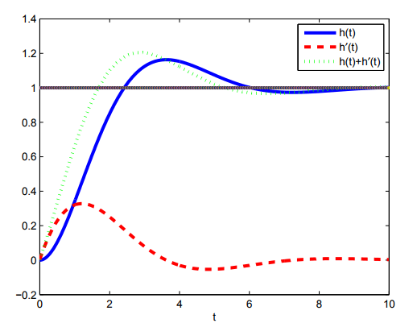

16.06 Principles of Automatic Control | Lecture 7

## Влияние «нулей» на переходный процесс

Мы рассматривали реакцию системы второго порядка:

$$G(s) = \frac{\omega_n^2}{s^2 + 2 \zeta \omega_n s + \omega_n^2}$$

Но что было бы если бы мы имели «ноль» в числителе? Как это бы повлияло на реакцию системы? Представим:

$$G(s) = \frac{(\alpha s + 1) \omega_n^2}{s^2 + 2 \zeta \omega_n s + \omega_n^2}$$

Тогда реакция на ступенчатое воздействие, согласно обратному преобразованию Лапласа, будет равна:

$$H(s) = \frac{1}{s} \frac{(\alpha s + 1) \omega_n^2}{s^2 + 2 \zeta \omega_n s + \omega_n^2} = H_0 (s) + \alpha s H_0 (s)$$

$H_0$ равно:

$$H_0(s) = \frac{1}{s} \frac{\omega_n^2}{s^2 + 2 \zeta \omega_n s + \omega_n^2}$$

that is, the LT of the step response of the second order system without the zero.
The second term is a constant ($\alpha$) times s times $H_0(s)$. Since multiplying by $s$ is the same as differentiating in the time domain, we have that

$$h(t) = h_0(t) + \alpha \frac{d}{dt} h_0 (t)$$

where $h(t)$ is a step response with zero, and $h_0(t)$ is a step response without the zero.

**Example:**

$$G_0(s) = \frac{1}{s^2 + 2 \zeta s + 1},\;\zeta = 0,5$$

So a zero (with α ą0) tends to speed up time response increase overshoot.
Note that the zero is at root of

$$\alpha s + 1 = 0 \to s = - 1/\alpha$$

The effect is small if

$$\left| \alpha \omega_n \right| \ll 1$$

which is the same as

$$\left| - 1/ \alpha \right| \gg \left| \omega_n \right|$$

pic1.
zero here has big effect
zero here has small effect

## Non-Minimum Phase Zeros

For technical reasons, a zero in the right half plane are called “non-minimum phase zeros”. They have a funny (undesirable) effect on the response of a system.

For a NMP zero, $\alpha < 0$. So, the step response will be the original step response minus a constant times the derivative:

This results in initial “wrong way” behavior that is very undesirable. Examples of NMP systems:
1.	Space shuttle on approach
2.	Backing car

To get a backing car to return to a given line, must make the front end go the wrong way first:
path of the front end

## Effect of Additional Poles

What happens if we add a third pole?

$$G(s) = \frac{1}{\alpha s + 1} \frac{\omega_n^2}{s^2 + 2 \zeta \omega_n s + \omega_n^2}$$

The new step response will be the convolution of the step response without the additional pole with:

$$\frac{1}{\alpha} e^{-\frac{t}{\alpha}} \sigma (t)$$

So, net effect is that addition of the pole will smooth the original step response, increasing the rise time, and reducing the overshoot,

Переведено на Нотабеноиде
http://translate.kursomir.ru/book/30/62

Переводчики: nkryazhev
