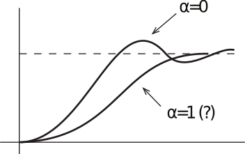

16.06 Principles of Automatic Control | Lecture 7

## Влияние «нулей» на переходный процесс

Мы рассматривали реакцию системы второго порядка:

$$G(s) = \frac{\omega_n^2}{s^2 + 2 \zeta \omega_n s + \omega_n^2}$$

Но что будет если в числителе появится «нуль»? Как это повлияет на реакцию системы? Представим что:

$$G(s) = \frac{(\alpha s + 1) \omega_n^2}{s^2 + 2 \zeta \omega_n s + \omega_n^2}$$

Тогда реакция на ступенчатое воздействие, согласно обратному преобразованию Лапласа, будет равна:

$$H(s) = \frac{1}{s} \frac{(\alpha s + 1) \omega_n^2}{s^2 + 2 \zeta \omega_n s + \omega_n^2} = H_0 (s) + \alpha s H_0 (s)$$

$H_0$ равно:

$$H_0(s) = \frac{1}{s} \frac{\omega_n^2}{s^2 + 2 \zeta \omega_n s + \omega_n^2}$$

that is, the LT of the step response of the second order system without the zero.
Второе слогаемое это константа ($\alpha$) умноженная на $s$ и умноженная на $H_0(s)$. Поскольку умножение на $s$ это тоже самое что и дифференцирование во временой области, мы получим следующее

$$h(t) = h_0(t) + \alpha \frac{d}{dt} h_0 (t)$$

где $h(t)$ это реакция системы при наличии нуля, и $h_0(t)$ переходной процесс без нуля.

**Пример:**

$$G_0(s) = \frac{1}{s^2 + 2 \zeta s + 1},\;\zeta = 0,5$$

So a zero (with $α>0$) tends to speed up time response increase overshoot.

Мы видим что нуль (при $α>0$) приводит к ускорению переходного процесса, но увеличивет перерегулирование.

Note that the zero is at root of

$$\alpha s + 1 = 0 \to s = - 1/\alpha$$

The effect is small if

$$\left| \alpha \omega_n \right| \ll 1$$

which is the same as

$$\left| - 1/ \alpha \right| \gg \left| \omega_n \right|$$

## Неминимально фазовые нули

For technical reasons, a zero in the right half plane are called “non-minimum phase zeros”. They have a funny (undesirable) effect on the response of a system.

По техническим причинам, нули располженные в правой полуплоскости называют «неминимально-фазовыми» нулями. Они создают забавны (нежелательный) эффект в реакции системы.

For a NMP zero, $\alpha < 0$. So, the step response will be the original step response minus a constant times the derivative:
Для неминимально-фазового нуля, $\alpha < 0$. Поэтому, реакция на ступенчатое воздействие такой системы будетм выглядить как обычная реакция минус константа умноженная на производную.

This results in initial “wrong way” behavior that is very undesirable. Examples of NMP systems:
1.	Space shuttle on approach
2.	Backing car

В результате мы можем наблюдать как бы "движение в противоположную сторону" в самом начале реакции системы, что очень нежелательно. Примеры неминимально-фазовых систем:
1. Космический шатл во время посадки
2. Автомобиль сдающий назад

To get a backing car to return to a given line, must make the front end go the wrong way first:

Для того чтобы сдающий назал автомобиль вернулся на нужную линию, передную часть нужно сначала отвернуть в другую сторону:

## Влияние дополнительных полюсов

Что произойдет если мы добавим третий полюс?

$$G(s) = \frac{1}{\alpha s + 1} \frac{\omega_n^2}{s^2 + 2 \zeta \omega_n s + \omega_n^2}$$

The new step response will be the convolution of the step response without the additional pole with:

$$\frac{1}{\alpha} e^{-\frac{t}{\alpha}} \sigma (t)$$

So, net effect is that addition of the pole will smooth the original step response, increasing the rise time, and reducing the overshoot,

В общем суммарным эффектом будет то что этот третий дополнительный полюс сгладить оригинальный переходный процесс, увеличит (затянет) время нарастания и снизит перерегулирование,

